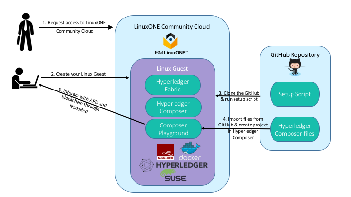

**WORK IN PROGRESS** Install and Use on Hyperledger Fabric on LinuxONE Community Cloud 

# DeveloperWorks Code

* Code: TBD Link
* Video: TBD Link

# Create chaincode for blockchain on LinuxONE Community Cloud using Hyperledger Composer

Blockchain technologies are enabling organizations to interact in completely new ways and are driving new business models. Hypledger Project, an open source project through the Linux Foundation, has been at the forefront of this innovation by creating blockchain technologies specifically for businesses. As networks of organizations understand how to leverage the technology, developers are facing new pardaigms. Blockchain further necessitates the need for business to work closely with their developers to create solutions that can better drive efficiency in various aspects of existing business processes. One of the projects under the Hyperledger Project umbrella, Hyperleder Composer, better enables the alginment of business requires with technical expertise through a business-centric abstraction. Hyperledger Composer is built with JavaScript and leverages modern tools including node.js, nom, CLI and popular editors. This provides developers mutliple choices for writing, deploying and testing chaincode while utilizing the business network model provided through Hyperledger Composer. 

#### By: Barry Silliman, Jennifer Foley

## Overview 

Blockchain technology is rapidly growing. According to one [article](https://www.cryptocoinsnews.com/pwc-expert-1-4-billion-invested-blockchain-2016/) there was $1.4 billion invested in blockchain technologies in 2016 alone. Estimates show that by [2024 the global blockchain market is expected to be worth $20 billion](http://www.prnewswire.com/news-releases/worldwide-blockchain-technology-market-is-anticipated-to-exhibit-a-cagr-of-587-between-2016-and-2024-elimination-of-third-parties-improves-demand-and-security-of-online-transactions--tmr-611067345.html) and that for [2017 the average investment in blockchain projects is $1 million](https://www.techinasia.com/bankers-like-blockchain). With so many resources being poured into the technology to develop it and create new offerings with it, many people are left wondering where to begin and how it could possibly work with existing business processes.

This journey focuses primarily focuses on the *where to begin* question. It does begin to address the *integrating with existing business processes* as well. In this journey, you will create a development environment for Hyperledger Fabric by using Hyperledger Composer. In the environment setup, you will create a small business network running Hyperledger Fabric v1beta. The environment is running on LinuxONE technology. Yes, it can run on various platforms. LinuxONE was chosen as the platform of choice because of the isolation, availability, scalability and encryption the underlying hardware can provide. Additionally, running a blockchain network on LinuxONE can potentially allow for additional performance gains while decreasing security risks through cross-memory communication to existing Systems of Record (E.g. SCM or ERP) or transactional middleware (E.g. CICS, IMS, DB2 or batch systems).

In this journey you will request access to a LinuxONE guest on the LinuxONE Community Cloud, run a script that creates your environment in your LinuxONE guest, interact with Hyperledger Composer and create and deploy a blockchain application.

## Flow and diagram

1. The user must request access to [LinuxONE Community Cloud](https://linuxone20.cloud.marist.edu/cloud/#/register). This will give them the ability to create a SLES Linux guest to run their environment in.
2. LinuxONE Community Cloud offers a variety of configurations. The user will select the configuration needed to support the environment and start it up. Once this step is done, the user can log into the system through ssh.
3. The items needed for the journey, a setup script and a Hyperledger Composer business network artifact, are stored in a GitHub repository. To utilize these during the lab, the user will clone the GitHub repository to the Linux guest local filesystem.
4. The setup script script calls DockerHub to pull down specific Hyperledger Fabric images. Once the pull is complete, an npm install of Hyperledger Composer will begin to equip the guest with Hyperledger Composer and associated tools like command line interface. After completion of Hyperledger Composer, the script will install and start the Composer Playground, a browser based user interface to Hyperledger Composer. The user will also run verification steps to become familiar with their tooling and establish everything is in place.
5. After importing the business network archive file to the Composer Playground, the user will begin developing chaincode. Once working chaincode is tested, the Composer Playground will be connected to the running Hyperleder Fabric through a Connection Profile. The user will deploy the chaincode to blockchain.

## Components

* LinuxONE Community Cloud SLES guest
* Docker
* Docker-Compose
* Node and npm
* Hyperledger Fabric
* Hyperledger Composer
* Composer Playground
* Terminal for ssh
* Browser (Firefox or Chrome recommended)

## Technology

## Links

Tutorials for Hyperledger Composer: https://hyperledger.github.io/composer/tutorials/tutorials.html

Tutorials for Hyperledger Fabric: https://hyperledger-fabric.readthedocs.io/en/latest/chaincode.html

## Blog post

