 **Work in progress!**
# Hyperledger Fabric and Hyperledger Composer on LinuxONE

## Architecture


This journey will guide you through the following process.

1. Requesting access to the LinuxONE Community Cloud.
2. Creating your Linux guest on the LinuxONE Community Cloud.
3. Setup and verification of your blockchain environment.
4. Creating a blockchain project in Hyperledger Composer.
5. Interacting with blockchain and third party APIs through Composer Rest Server and NodeRed.


## Application Overview
The blockchain workshop is intended to give you a basic understanding of how a developer would interact with Hyperledger Fabric using Hyperledger Composer. In this workshop you will use a browser based UI to modify chaincode, test your code and deploy your changes. You will also learn how tooling can take the code and generate API to allow for application integration through a REST-ful interface. 

This lab will be broken into three parts: 

1. Creating your guest and environment.
2. Writing chaincode and generating API.
3. Using NodeRed to test API integration.

<<<<<<< HEAD

## Steps

### [Part 1 \- Setting up your LinuxONE Community Cloud guest](#part-1---setting-up-your-linuxone-community-cloud-guest)

1. [Request access to LinuxONE Community Cloud\.](#request-access-to-linuxone-community-cloud)

2. [Create your LinuxONE guest](#create-your-linuxone-guest)

3. [Setup your Linux guest for Hyperledger Fabric and Hyperledger Composer](#setup-your-linux-guest-for-hyperledger-fabric-and-hyperledger-composer)

4. [Verify the installation of Hyperledger Fabric and Hyperledger Composer](#verify-the-installation-of-hyperledger-fabric-and-hyperledger-composer)

### [Part 2 — Creating a blockchain application and generating API](#part-2--creating-a-blockchain-application-and-generating-api)

5. [Importing the components of your blockchain application](#importing-the-components-of-your-blockchain-application)

6. [Creating your blockchain application](#creating-your-blockchain-application)

7. [Test application code](#test-application-code)

8. [Deploy application to Hyperledger Fabric](#deploy-application-to-hyperledger-fabric)

9. [Generating API from your blockchain application](#generating-api)

###[Part 3 — Utilizing blockchain API through NodeRED](#Part 3 — Utilizing blockchain API through NodeRED)

10. [Importing your flow into NodeRED](#importing-your-flow-into-nodered)
11. [Modifying your flow to call your API](#modifying-your-flow-to-call-your-api)
12. [Interacting with blockchain through a dashboard](#interacting-with-blockchain-through-a-dashboard)

=======
  
>>>>>>> 38d012aa9671efe10dede4cca8c1b6b7b0110183

## Workshop Instructions
### Scenario Overview
For this journey, we will simulate a thermostat and a temperature gauge to provide us temperature data. In a real world scenario, this could be a temperature sensor in your house or in an office building. The sensor could be connected to a real thermostat like Nest or other smart home devices via API. To keep family members, housemates, friends or children from excessively running air conditioning or heat, they must first find out if they have permission to adjust the thermostat by running a transaction defined in a smart contract running on Hyperledger Fabric. The contract will check the value recorded in the ledger for the temperature gauge to determine if their thermostat adjustment is environmentally friendly. Secondly, it will add integration to Weather.com to check current temperatures and adjust the thermostat to ideal settings based on the terms of the smart contract. 

### Part 1 - Setting up your LinuxONE Community Cloud guest

In this section of the journey you will request access to the LinuxONE Community Cloud, establish a SLES guest, run a setup script and verify the installation.

#### Request access to LinuxONE Community Cloud.

1. In a browser, go to https://developer.ibm.com/linuxone/ .

   

2. **Click** *Start your trial now*.

   

3. **Complete** the required fields on the page and **select** *Request your trial*.

   

4. You will come to the following page. **Click** *Sign In*.

   

5. Check your email for a registration confirmation similar to the following shown. You'll need your User ID and Password from this email for the next step.

   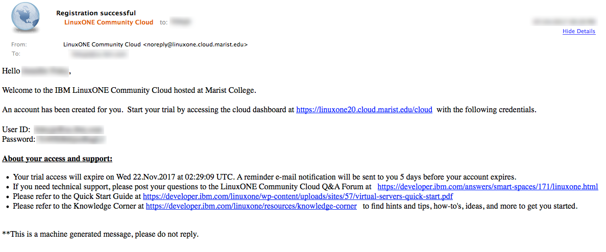

   #### Create your LinuxONE guest

6. Back in your browser, **enter** the *user ID* and *password* from your email. **Click** *Sign in*.

   * Note: Now is a good time to change your password to one you'll remember. This can be done after the initial sign in by selecting your username from the upper right corner of the web page and selecting account settings.

   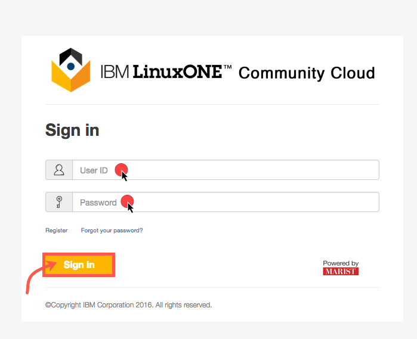

7. From the Home page of IBM LinuxONE Community Cloud, **select** *Manage Instances* on Virtual Servers under Infrastructure.

   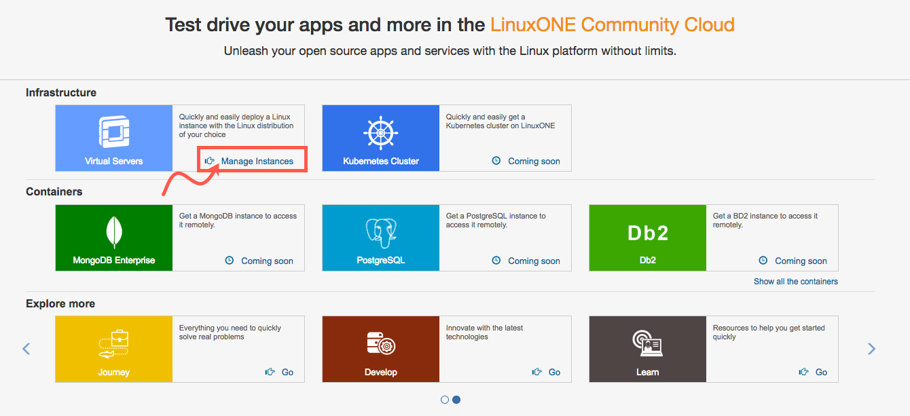

8. **Click** create.

   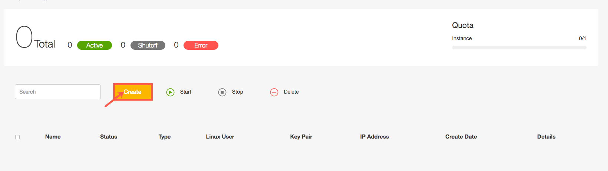

9. Complete the following information:

   * Select *General purpose VM* for the type.

   * Enter an instance name — `DJBlockchain`

   * Enter an insance description — `Blockchain guest for Developers Journey.`

   * Select *SLES12 SP2* for the image.

   * Select *LinuxONE-Medium* for the flavor.

     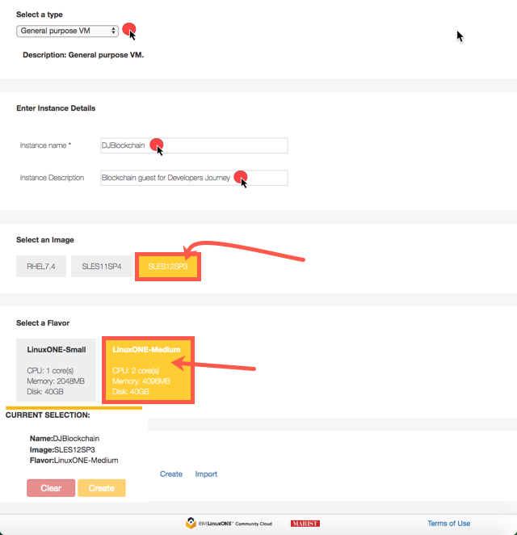

10. **Scroll down**. Under *Select a SSH Key Pair* **click** *create*.

 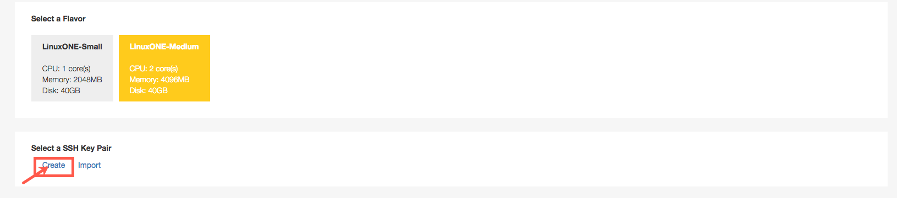

11. In the pop-up dialog, **enter** the key name, `DJBlockchain` and **select** *Create a new key pair*.

    

12. Depending on your computer, you may receive a prompt asking you if you would like to save the new key pair. If so, choose to **Save File**.

    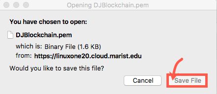

13. In the *Select a SSH Key Pair* box, **select** your newly create key pair, *DJBlockchain*.

    

14. Review the Current Selection information for accuracy and **click** *create* at the bottom of the screen to create your SLES 12 LinuxONE guest.

    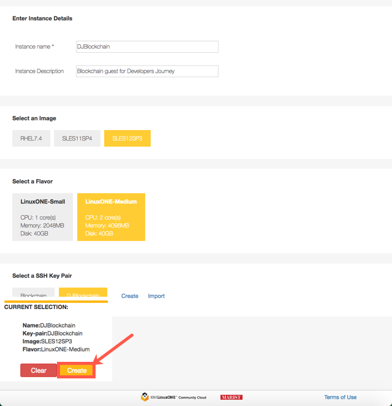

15. ​Watch the status of your newly create guest go through the following phases of start up:  networking :arrow_right: spawning :arrow_right: Active. When your guest shows active, it is ready for use.

    * *Note* — Write down the IP address of your guest. You'll need that for the next steps.

    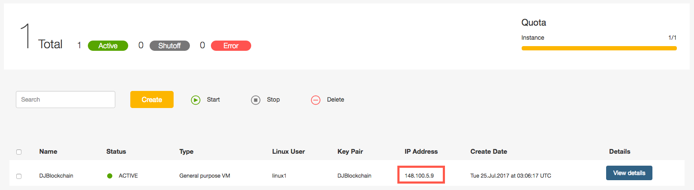

16. From a terminal on your computer, navigate to the directory where you saved the SSH Key Pair, *DJBlockchain*. An example location is shown below.

    


17. Modify the permissions of your private key by entering `chmod 600 DJBlockchain.pem`.

    

18. From the location where your *DJBlockchain.pem* SSH key pair is, enter the command `ssh -i DJBlockchain.pem linux1@xxx.xxx.x.x` where the x's correspond to your Linux guest IP.

19. **Type** `yes` to the continue connecting prompt and **hit** the *enter* key.

    

20. You are now connected into your IBM LinuxONE Community Cloud Guest!

    

    #### Setup your Linux guest for Hyperledger Fabric and Hyperledger Composer

21. Now it is time to setup your guest! Run the following command, to move the setup script from the Github Repository to your Linux guest.

    `wget https://raw.githubusercontent.com/IBM/HyperledgerFabric-on-LinuxOne/master/Linux1BlockchainScript.sh`

    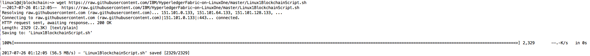

22. Enter `ls` to confirm the file is in your directory. 

    

23. To make the file executable, run `chmod u+x Linux1BlockchainScript.sh` and then `ls` to make sure that it is showing as an executable file.

    

24. Before running the script, you'll need to add your user id to the docker group. To do this, enter `sudo usermod -aG docker linux1` . To verify that the command worked, enter `docker` . Your output should look like the image below.

    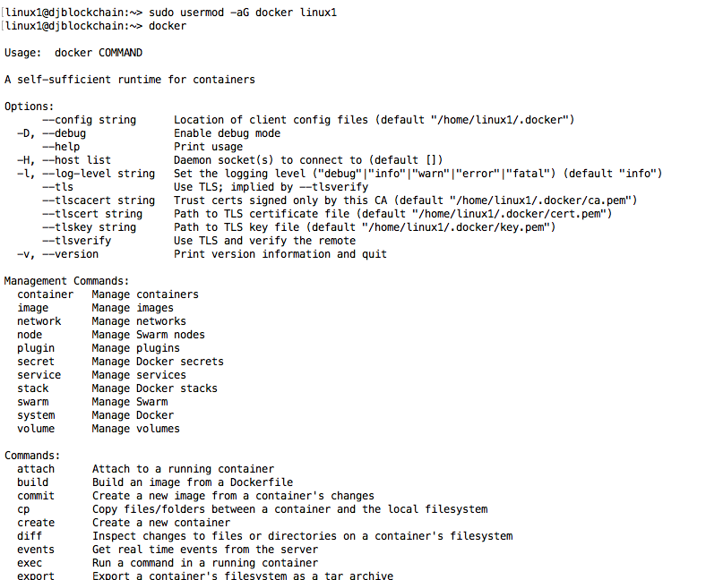

25. For this changes to take effect for the script, exit the ssh session by typing `exit`.

    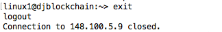

26. Log back in to your guest. `ssh -i DJBlockchain.pem linux1@xxx.xxx.x.x`where x is the values for your guest's IP address. (Refer to step 15 if you need help finding it.)

    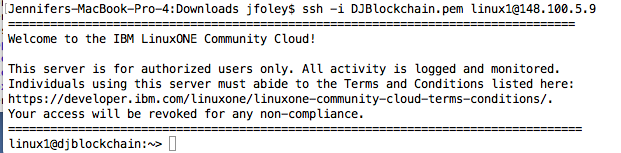

27. You're ready to run the setup script! Run the script using the following command, `./Linux1BlockchainScript.sh`. Be patient. It takes awhile!

    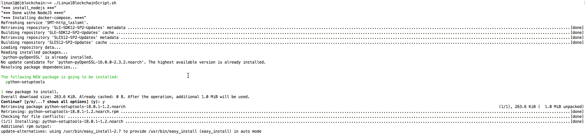

28. It's completed when the command line returns. It will look similar to the following image.

    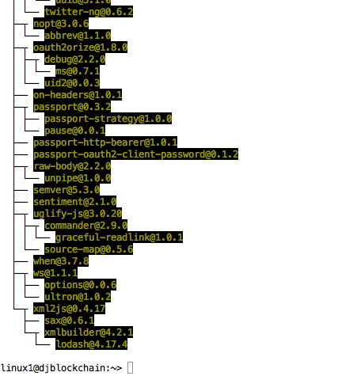

    #### Verify the installation of Hyperledger Fabric and Hyperledger Composer

29. To verify the installation, we will need to modify your .profile to be able to call newly installed packages. To do this type, `vi .profile`.

    

30. To edit the .profile take the following actions:

    * Use the **arrow down key** to move the cursor to the last line of the file.

    * Use the **right arrow key** to move the cursor to the last letter of the file.

    * Type `i` to go into insert mode.

    * Hit **enter** twice to create two new lines.

    * Enter the following, `export PATH=/data/npm/bin:$PATH`

    * Hit **escape**.

    * Enter `:wq` and hit **enter** to save your changes.

      

31. For the changes to take place, exit your ssh session by typing `exit`.

    

32. Log back in to your guest. `ssh -i DJBlockchain.pem linux1@xxx.xxx.x.x`where x is the values for your guest's IP address. (Refer to step 15 if you need help finding it.)

    

33. To see if your blockchain network is up and running, use the command `docker ps -a`. You should see 4 containers with image names like the ones shown below.

    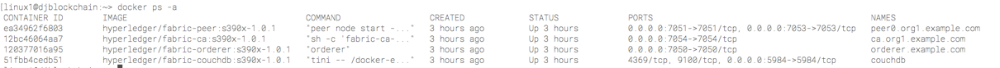

34. Verify that the composer command line interface and other tools were installed by entering `composer -v`.

    

35. Verify Composer Playground is running by looking for its process using the command, `ps -ef|grep playground`. 

    

36. Open a browser and enter `xxx.xxx.x.x:8080` into the address bar where the x's correspond to your Linux guest's IP address. You should see the following:

    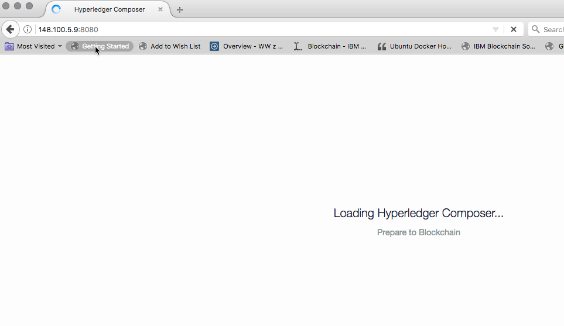

    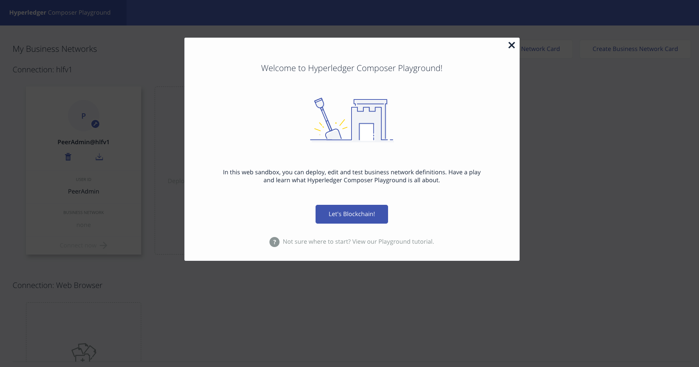

37. Congratulations! Part 1 is now complete! Lets get to work on the fun part. :smiley:


### Part 2 — Creating a blockchain application and generating API

#### Importing the components of your blockchain application

1. In a terminal on your computer, move to the home directory. `cd $HOME`

2. If not already installed, [install Git](https://git-scm.com/book/en/v2/Getting-Started-Installing-Git_) for your computer. 

3. Once Git is installed, run the following command to clone the needed materials for this exercise. `git clone https://github.com/IBM/HyperledgerFabric-on-LinuxOne.git`

   

4. To find the files you'll need for this, `cd HyperledgerFabric-on-LinuxOne/code/` and then run `ls` to see what is in the directory.

   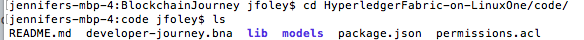

5. Enter `pwd` to see where you are on your system. Save this information. You'll need it in a few steps.

   

6. Go back to your browser that has Composer Playground open. If you've closed it, you can open it in your browser by entering `xxx.xxx.x.x:8080` into the address bar where the x's correspond to your Linux guest's IP address.

   * **Note:** You will need to view the browser in Full Screen (fully expanded) mode to be able to access everything and prevent issues with inability to scroll on certain screens.

   

7. Scroll down on the left side of the Composer Playground to select **Import/Replace**.


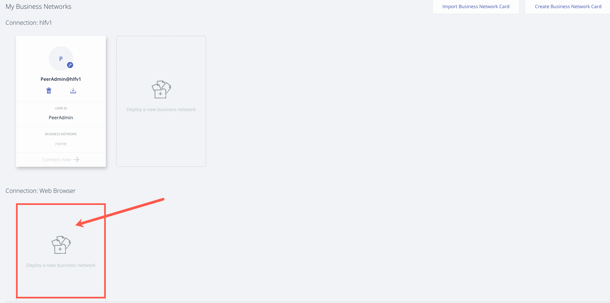


6. Select **Empty Business Network** and click **Deploy**.
   
7. From the _Import/Replace dialog window_, select **Replace & Import**.
   * **Note for Hyperledger Composer V0.7 - 0.9:** When you deploy your business network to Hyperledger Fabric, the business network name is used as the chaincode ID. If the business network name is changed then a new chaincode ID will be issued and used on deploy. All existing data in blockchain will be lost due to the change. We don't have to worry about that right now.


9. Name your blockchain application. Select the **pencil** to edit the name and version. 

   

10. Change the name and version to `blockchain-journey` and `1.0`.

 

11. Select **Add a File**.

    

12. From the *Add a file* pop-up dialog, select **browse**.

    

13. In the file explorer window, navigate to where you downloaded the files. Refer to step 5 if you need help finding this location. **Select** *README.md* and **Click** *Open*.

    

14. **Select** *Add*.

    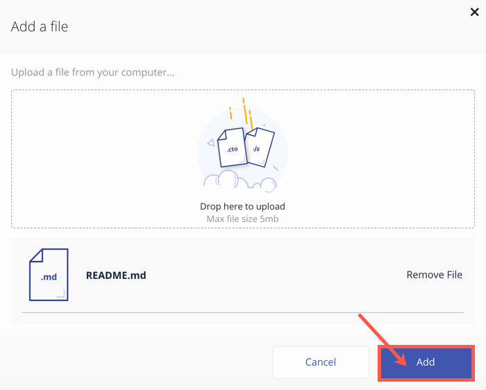

15. On the *Current definition will be replaced* dialog, **select** *Replace & Import*.

    

16. Let's keep adding the files to the Composer Playground. **Select** *Add a file*.

    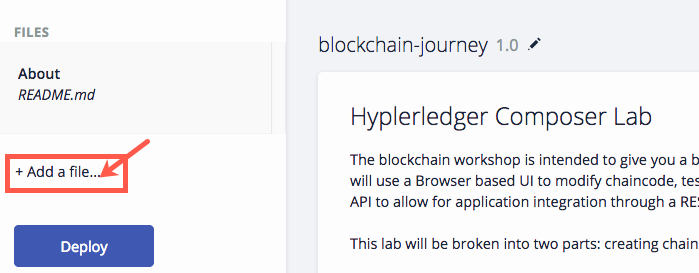

17. From the *Add a file* pop-up dialog, select **browse**.

    

18. In the file explorer window, navigate to where you downloaded the files. Refer to step 5 if you need help finding this location. Go into the *models* folder.  **Select** *org.acme.sample.cto* and **Click** *Open*. This is your model file that defines the assets, participants and transactions you'll use your in blockchain application.

    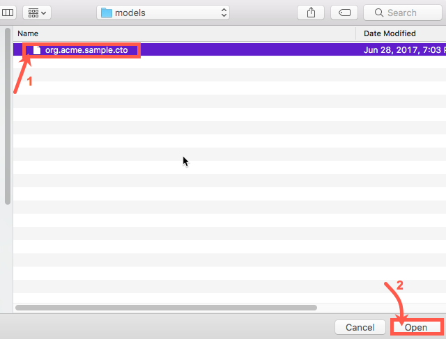

19. Click **Add**. 

    

20. **Select** *Add a file*.

    

21. From the *Add a file* pop-up dialog, select **browse**.

    

22. In the file explorer window, navigate to where you downloaded the files. Refer to step 5 if you need help finding this location. **Select** *permissions.acl* and **Click** *Open*.

    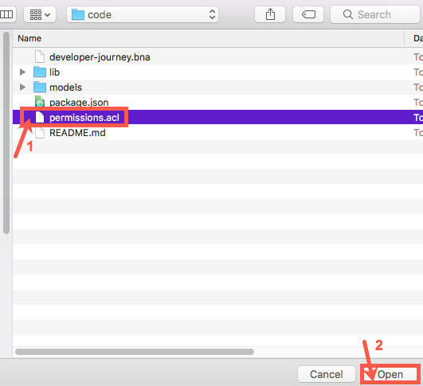

23. **Select** *Add*.

    

24. **Select** *Add a file*.

    

25. In the file explorer window, navigate to where you downloaded the files. Refer to step 5 if you need help finding this location. Go into the *lib* folder.  **Select** *logic.js* and **Click** *Open*. This is your JavaScript file that contains the logic for your model.

    

26. **Select** *Add*.

    

27. Your files are all now loaded into Composer Playground. **Click** *Deploy* on the left side of the browser. 

    

    #### Creating your blockchain application

28. Click on **Model File**.

    

29. Click in the **editor** on the right to begin writing your models. 

    * NOTE: **DO** **NOT** modify the namespace during the lab.

      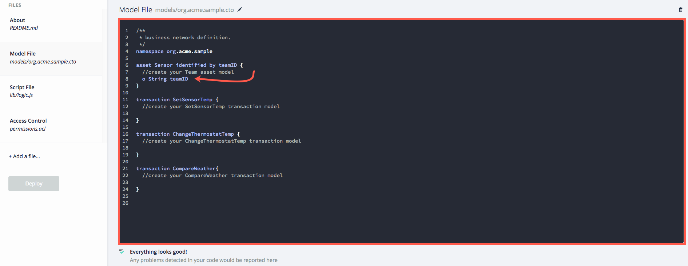

30. On a new line, give your asset `Sensor` the following attributes.

    * Note: a small "o" is used as a bullet in the model.

    * `o String teamID` — this will be the value that is assigned to your team. (already there!)

    * `o String teamName`— this could be anything! Come up with something clever!

    * `o Double sensorTemp` — temperature from the Raspberry Pi will be stored here.

    * `o Double thermostatTemp`— you will create a temperature for the thermostat.

    * `o String recommendation`— this will be populated based on the `CompareWeather` transaction.

    * **Click** *Deploy* to save changes.

      

31. Now create your first transaction model for `SetSensorTemp`. Enter the following attributes:

    * `--> Sensor gauge` — The transaction will need to put data into the `Sensor` asset. This passes a reference to the asset so we can work with the asset in the logic for the transaction.

    * `o Double newSensorValue` — This is the variable that will be set by the temperature passed into the transaction from the NodeRed Sensor for picking up temperature.

    * *Click** *Deploy* to save changes.

      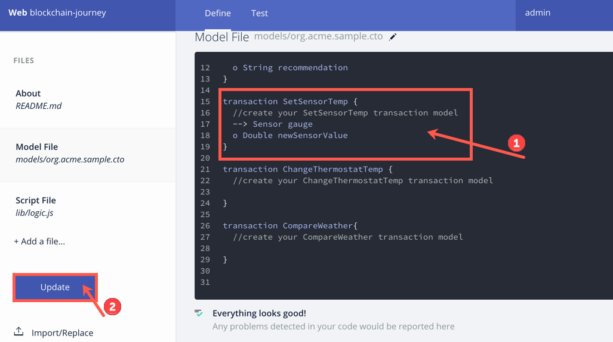

32. Build your `ChangeThermostatTemp` transaction model. Add the following:

    * `--> Sensor thermostat` — The transaction will need to put data into the `Sensor` asset for the thermostat. This passes a reference to the asset so we can work with the asset in the logic for the transaction.

    * `o Double newThermostatValue` — This allows for a new, proposed value to be sent into the transaction. In the logic tab, we will use this value to compare to what the gauge says and decide if the thermostat value should be adjusted.

    * **Click** *Deploy* to save changes.

      

33. Enter the following values to build your `CompareWeather` transaction model:

    * `--> Sensor recommend` — The transaction will need to put data into the `Sensor` asset. This passes a reference to the asset so we can work with the asset in the logic for the transaction.
    * `o Double outsideTemp` — Looking at the [Weather.com API](https://twcservice.eu-gb.mybluemix.net/rest-api/#!/Current_Conditions/v1locobscurrent) for Current Conditions, you can see all of the possible data that the call could return. Based on the data, it was decided to take the actual outside temperature and the feels like temperature to give a recommendation on thermostat settings. This variable stores the value passed into it via NodeRed from Weather.com for the outside temperature.  The model on the API page shows up whether the data is returned in Celsius or Fahrenheit and its variable type. In this exercise we will use Celsius.

    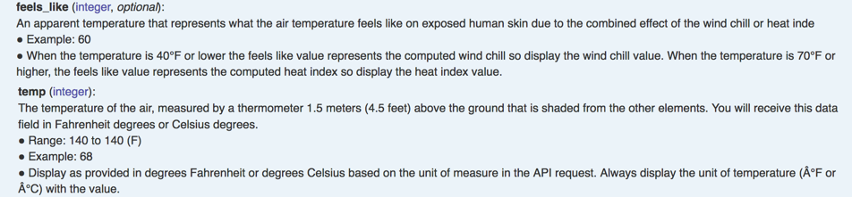

    * `o Double feelsLike`— the variable to store the feels_like value from Weather.com.

    * **Click** *Deploy* to save changes.

      

34. Click on the **Script File** tab.


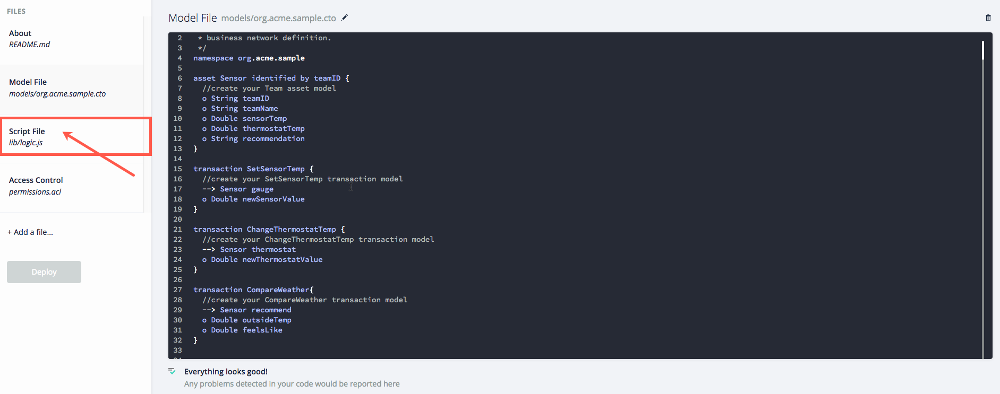


35. **Review the code in the editor. **Verify that your variable names match the variable names here.  Capitalization does matter! If names don't match, you'll have errors. 

    * Any guesses what the code is doing for each transaction?

      

    #### Test application code

36. Click on the **Test** tab at the top to try out your code.


37. Notice that in this particular case because we have no participants, the **Test** tab has opened to the **Asset** menu on the left. You must have an asset to be able to run any of the transactions.

    * Click **Create New Asset**.

      

38. Create an example asset to test your code by filling in the following information:

   * `"teamID": "teamID:**xxx**"` where ** **xxx** ** is any team number you'd like.

   * `"teamName":""` — this could be any name you'd like. Be clever! :bowtie:

   * `"sensorTemp": **0**` — Set ** **0** ** to any value. When you work with NodeRed, temperatures will be in Celsius.

   * `"thermostatTemp": **0** `— Set ** **0** ** to any value. This is initializing your thermostat so pick a value you want to work with.

   * `"recommendation": "" `— Leave this as is.

   * *Make a note somewhere** of the values you used for `sensorTemp` and `thermostatTemp`.

     

39. Click **Create New**.

   

40. Once your **Team** asset is created it should show in the registry as shown below.

    

41. You're ready to run your first transaction. **Click** on *Submit Transaction*.

    

42. The **Submit Transaction** dialog will open a new window. 

    * Make sure that the **Transaction Type** is set to `SetSensorTemp`.

    * Modify the JSON data`"asset": "resource:org.acme.sample.Team#teamID:xxx"`  — enter your team's identifier in place of the value where **xxx** is in the sample JSON data.

    * Modify the JSON data`"newSensorValue": 0` — enter a value your sensor could have.

    * Click **Submit**.

      

43. If you submitted the transaction with your correct team ID, then you should have a transaction showing in your registry with the data you entered in the prior step. Congratulations! You've now completed a transaction. :thumbsup:

    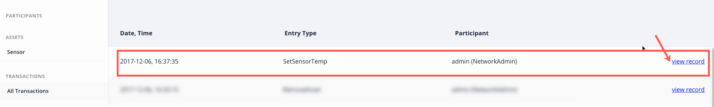

44. Verify that `SetSensorTemp` updated the `sensorTemp`value in your asset. Click **Sensor**.

    

45. Check the `sensorTemp` value. Does it have the new value from the `SetSensorTemp` transaction?

    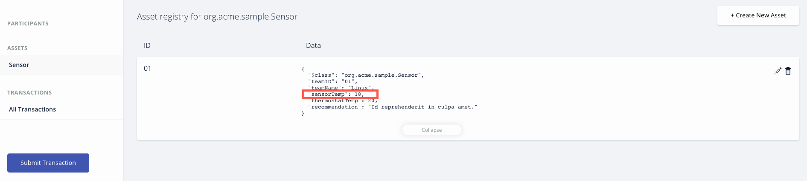

46. Let's do another transaction. Select **Submit Transaction**.

    

47. This time let's run, `ChangeThermostatTemp`. 

   * In the **Transaction Type** drop down, select `ChangeThermostatTemp`.
     

   * Edit the sample JSON for the transaction`"asset": "resource:org.acme.sample.Team#teamID:xxx"`— change **xxx** to your team ID value.

   * Edit the sample JSON for the transaction`"newThermostatValue": 0` — Replace **0** with a value to which you would like to see if you can adjust the thermostat.

   * Click **Submit**.

     

   * If you select a temperature for the thermostat that is not within 3 degrees of the `sensorTemp` value, then you will get an error message like the one below. If you get this message, enter another value and click submit.

     

   * If you do have permission to adjust the thermostat, you will be returned back to the transaction registry where you can see the data you just submitted.

     

   * If for some reason you forget to modify your teamID value or update it to the wrong value, you will see an error like the one shown below. Check your value for teamID and try again.

     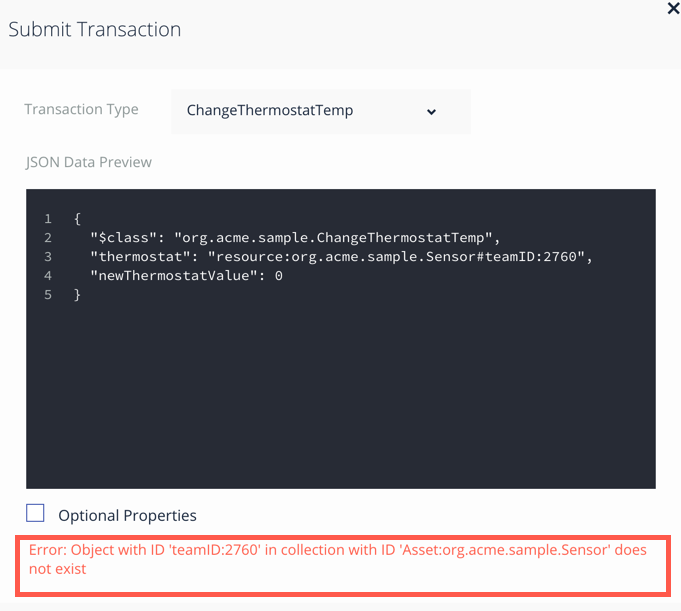

48. Verify that the last transaction updated your asset. Click **Sensor**.

    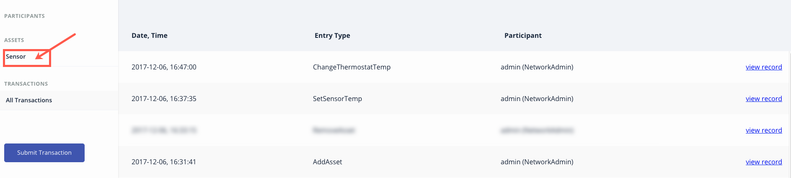

49. Verify that the `thermostatTemp` attribute for your Team has been updated to the value you gave successsfully in the `ChangeThermostatTemp` transaction.

    * **Note**: In step 40, you can verify that the thermostat was originally set to 20 and is now set to 16.

      

50. Time to work with the `CompareWeather` transaction. Click **Submit Transaction**.

    

51. Select **CompareWeather** from the *Transaction Type* drop down.

    

52. Complete the **CompareWeather** transaction.

    * Modify the JSON, `"asset": "resource:org.acme.sample.Team#teamID:xxx"`— Replace **xxx** with your team ID.

    * Modify the JSON for`"outsideTemp": 0`— Enter a value for an outside temperature.

    * Edit the JSON for`"feelsLike": 0` — Enter a value for what temperature it could feel like outside.

    * Click **Submit**.

      

53. Verify that your transaction is showing in the Transaction Registry.

    

54. Click on **Sensor**. 

    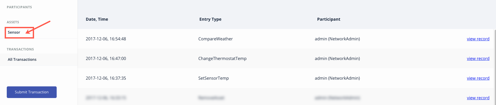

55. Verify there is now a message in the `recommendation`variable in your Team asset and that the `thermostatValue` has been updated to the recommended value.

    

56. Continue testing your code for all scenarios to understand what your contract(s) can do. The hints to the remaining scenarios are as follows: (Yes, you'll have to look at the Script File under the Define Tab to figure out the criteria.)

    * ChangeThemostatTemp:
      - [ ] A successful transaction where the `thermostatValue` is updated in the Sensor asset.
      - [ ] An error message in the *Submit Transaction* window advising you do not have permission to adjust the thermostat.
    * CompareWeather:
      - [ ] A transaction based on `outsideTemp` values where it is really hot.
      - [ ] A transaction based on `outsideTemp` values where it is quite nice.
      - [ ] A transaction based on `outsideTemp` values where it is cold.
      - [ ] A transaction based on `feelsLike` values where it hot.
      - [ ] A transaction based on `feelsLike` values where it is quite nice.
      - [ ] A transaction based on `feelsLike` values where it is cold.

    * **Note:** You should verify that your asset values have been updated appropriately after each transaction like you did in prior steps.


#### Deploy application to Hyperledger Fabric

57. In your terminal connected to your Linux guest, enter the command `cd ~/.composer-connection-profiles/`. Enter `ls` to see the profiles in the directory. The profile was created during the setup script. You'll need the information in it to connect Hyperledger Composer to Hyperledger Fabric.

    

58. Move into the profile directory, `cd hlfv1` and view the file in it by doing `cat connection.json`. Keep the terminal available, you'll need to view this information in just a second.

    

59. Back in your browser where Hyperledger Composer Playground is running, **click** the *Define* tab and then **click** *Export* to save your code to your desktop. This is a safety measure. Export saves all of the indivudual files we imported at the beginning of Part 2 into a compressed file called a business network archive (.bna).

    

60. In the pop-up dialog, **click** *Save File*.

    

61. In the upper right corner of your browser, **select** the *globe icon*.

    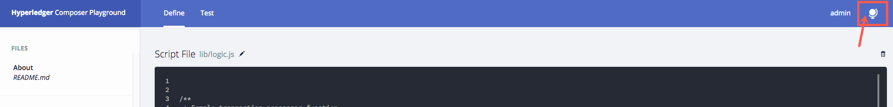

62. **Select** *Import or Create a Profile*.

    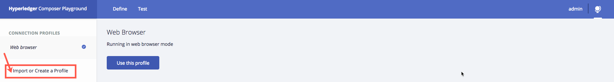

63. On the *Import/Create a Connection Profile* dialog, **select** *Hyperledger Fabric v1.0* and **click** *Add*.

    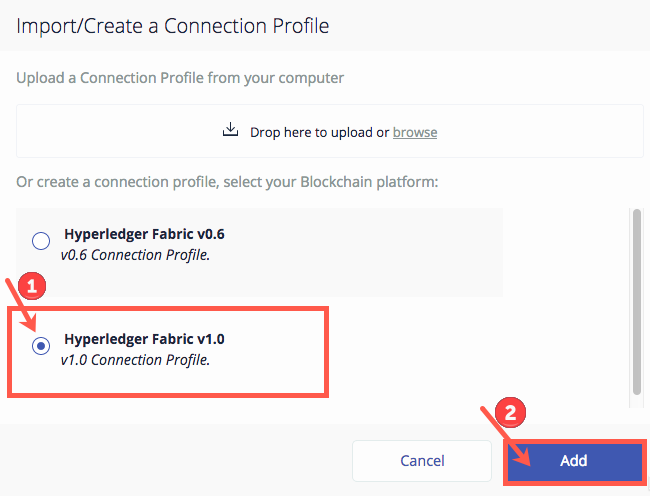

64. Complete the following fields according to the information in your connection.json on the Linux guest. This is in your terminal as found in step 58.**Information for Orderer, Channel, MSP ID, CA, Peers and Key Value Store must be exact.**

    * Connection Profile — LinuxONECC

    * Orderer(s) — `grpc://localhost:7050`

    * Channel — `composerchannel`

    * MSP ID — `Org1MSP`

    * CA — `http://localhost:7054`

    * Peer(s) — `grpc://localhost:7051`, `grpc://localhost:7053`

    * Key Value Store — `/home/linux1/.composer-credentials`

    * **Click** *Save*.

      

65. **Click** *Use this profile*.

    

66. In the *Connect with an identity* window, **click** *Add identity*.

    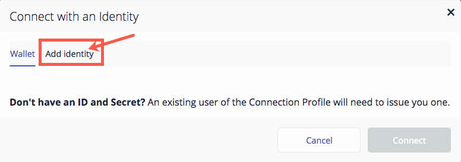

67. Create a User ID of `PeerAdmin` and a User Secret of `linux`. The User ID must be PeerAdmin but the User Secret could be anything.**Click** *Connect*.

    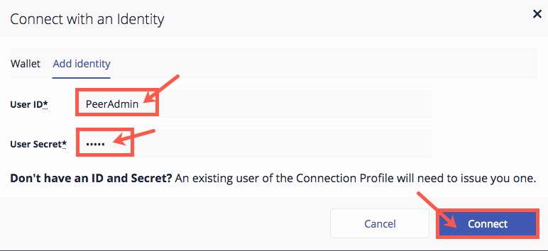

68. When the Composer Playground has successfully connected to your Hyperledger Fabric, you will see the following in your browser.

    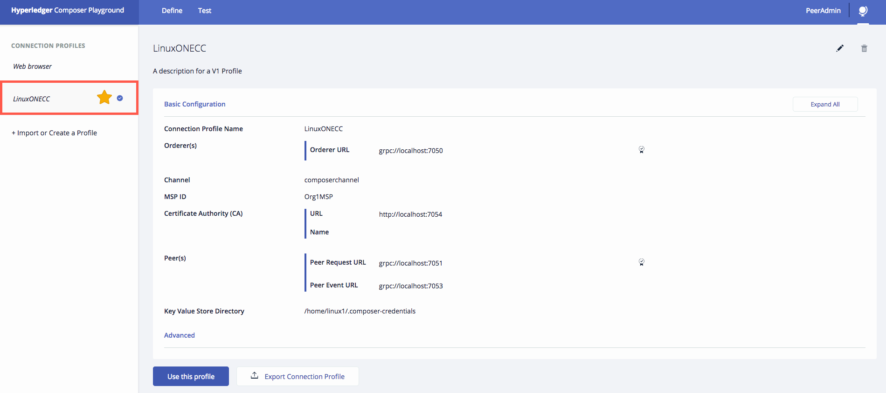

69. Back in your terminal, enter `docker ps -a` . You can see there is now a new container running where Composer Playground has deployed code to the Hyperledger Fabric.

    

70. Switch back to your Hyperledger Composer Playground browser, **click** *Define* and then **select** *About*.

    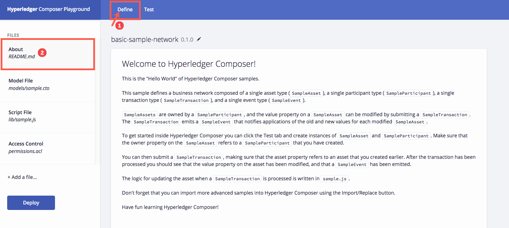

71. Notice that there is now a basic-sample-network application showing and not your blockchain-journey. We will need to import it to deploy it to the Hyperledger Fabric. **Select** *Import/Replace*.

    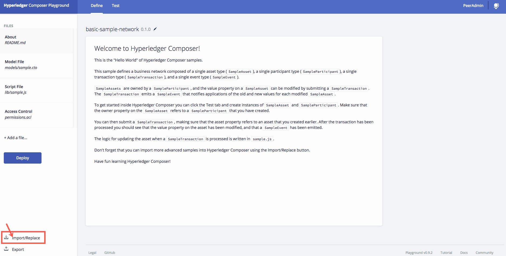

72. In the *Import/Replace Business Network* window, **select** *browse.*

    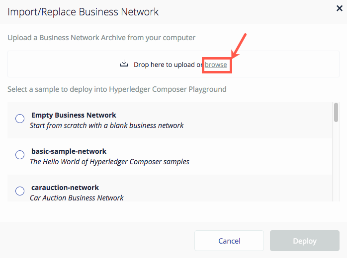

73. In the file explorer window, **navigate** to where you downloaded `blockchain-journey.bna`. **Select** *blockchain-journey.bna* and **click** *Open*.

    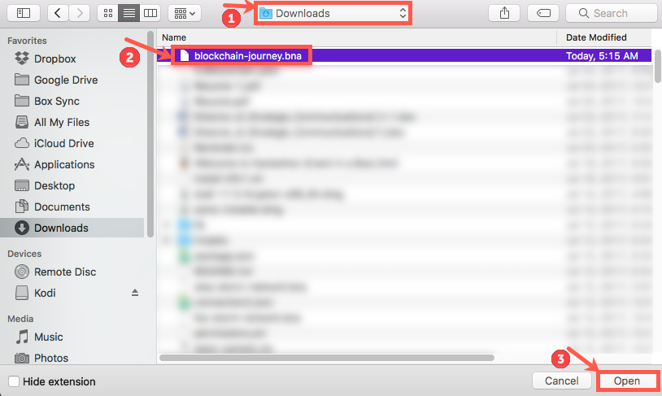

74. **Click** *Deploy* in the *Import/Replace Business Network* dialog to deploy your blockchain application to Hyperledger Fabric.

    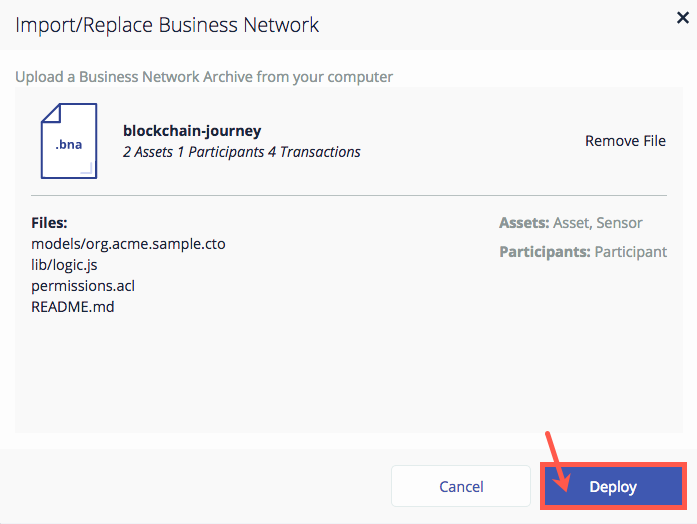

75. In the warning window, *Current definition will be replaced*, **click** *Replace & Import*.

    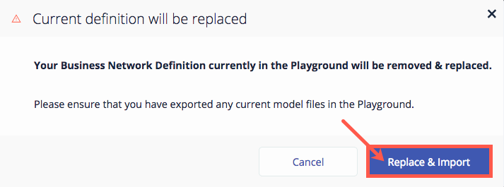

76. You should see your blockchain-journey in the Hyperledger Composer Playground when it is successfully deployed. Congratulations! You've deployed your first blockchain application to Hyperledger Fabric.

    * **Note:** As a safety measure, check the Model File and Script File to make sure your code is there. It is also good practice to run some transaction in the test tab.

    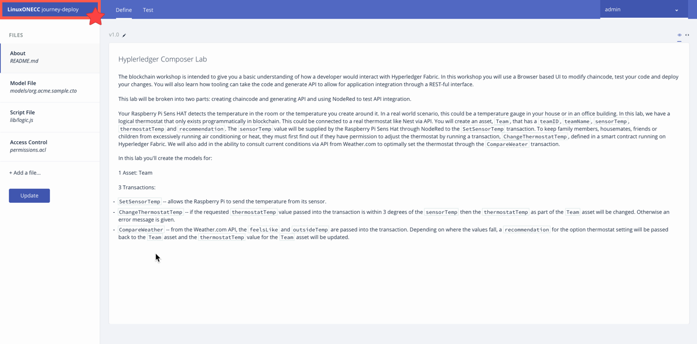

    #### Generating API

77. In your terminal, you'll need to edit your hosts file. 

    * `sudo vi /etc/hosts`

    * Enter `i` to begin insert mode.

    * Use your arrow keys to move to the end of the line that has `127.0.0.1       localhost`

    * Press `Enter` to start a new line.

    * On the new line, type in `xxx.xxx.x.x     djblockchain` where the x's is the IP address for your Linux guest.

    * Press `Esc` to leave insert mode.

    * Enter `:wq` to save your changes.

      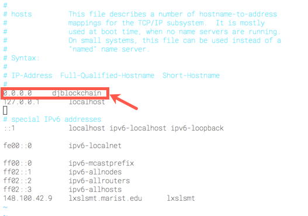

78. In your terminal, issue the following commands to start the API rest server:

    *  `mkdir /data/linux1/playground`

    * `nohup composer-rest-server -p hlfv1 -n org-acme-biznet -i PeerAdmin -s linux -N always >/data/linux1/playground/rest.stdout 2>/data/linux1/playground/rest.stderr & disown`

      

79. Verify the rest server process is running. `ps -ef|grep rest`

    

80. To see your API, go back to your browser and open a new tab or window. In the address bar, enter `http://xxx.xxx.x.x:3000/explorer` where the x's are the IP address for your Linux guest. You should see a page like the one shown.

    

81. Expand the different methods to see the various calls and parameters you can make through REST API. You can also test the API in this browser to learn how to form the API and see the responses.

    

82. Congratulations! You now have a working blockchain application and have created APIs to call your blockchain application.


###Part 3 — Utilizing blockchain API through NodeRED 


#### Importing your flow into NodeRED
1. Open NodeRED in your browser in a new tab or window. Enter `http://xxx.xxx.x.x:1880` in the address bar where the x's correspond to your Linux guest IP address.

   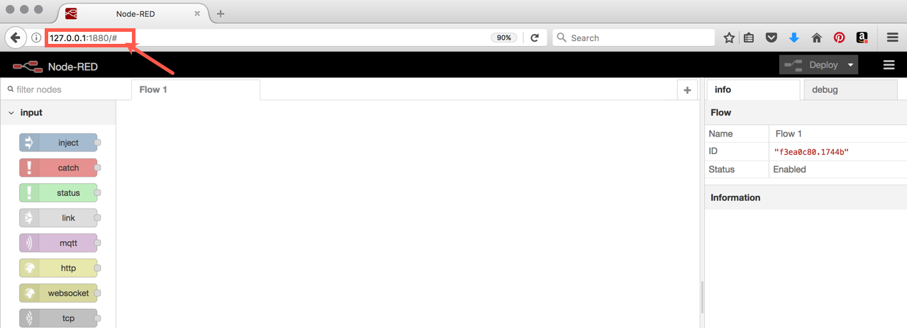

2. You'll need to add a few more nodes to your NodeRED palette to have complete working flows. To do this, **select** the *menu* button in the upper right corner.

   

3. **Select** *Manage Palette* from the drop down menu.

   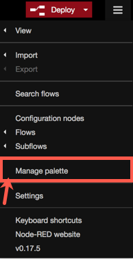

4. In the *User Settings* window, **click** *Install*, **type** `dashboard` in the search bar and select **install** next to *node-red-dashboard*.

   

5. In the *Install nodes* pop-up, **click** *Install*.

   

6. Now we will install a second set of nodes to get current weather conditions using WeatherUnderground.  In the *User Settings* window under *Install*, **type** `weather` in the search bar and select **install** next to *node-red-weather-underground*.

   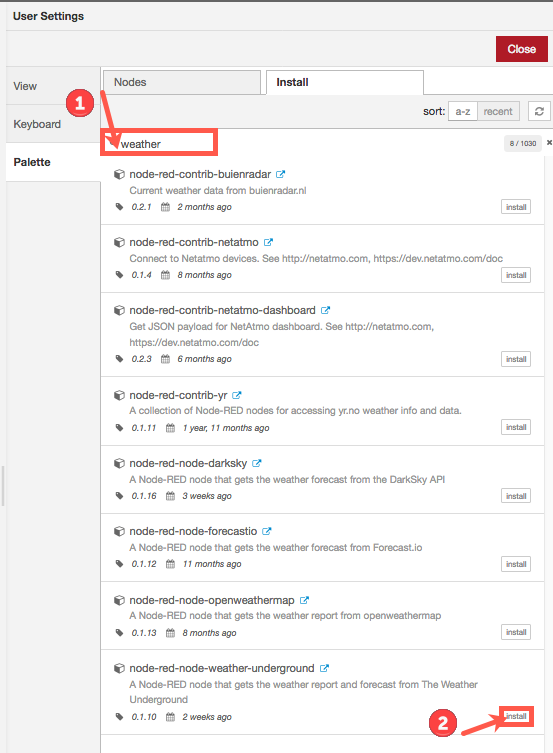

7. In the *Install nodes* pop-up, **click** *Install*.

   

8. Now it's time to install a RaspberryPi Sense Hat simulator. In the *User Settings* window under *Install*, **type** `sense` in the search bar and select **install** next to *node-red-pi-sense-hat-simulator*.

   

9. In the *Install nodes* pop-up, **click** *Install*.

   

10. **Click** *Close* to leave the User Settings dialog.

 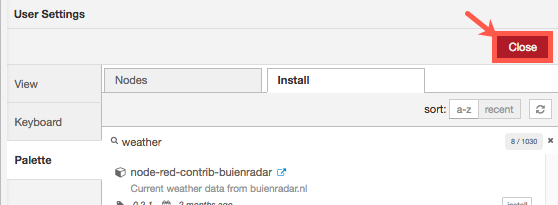

11. **Copy** the JSON below. 

    - It can also be found in the GitHub repository as `node-red.json`. To view it in GitHub, click on node-red.json, select raw and then copy it. 

    ```JSON
    [
        {
            "id": "f3ea0c80.1744b",
            "type": "tab",
            "label": "Blockchain",
            "disabled": false,
            "info": ""
        },
        {
            "id": "ac1e2713.68e3d",
            "type": "tab",
            "label": "Dashboard",
            "disabled": false,
            "info": ""
        },
        {
            "id": "bddbbeac.f1843",
            "type": "tab",
            "label": "Gauge Simulator",
            "disabled": false,
            "info": ""
        },
        {
            "id": "72360b12.36f004",
            "type": "ui_group",
            "z": "",
            "name": "Blockchain",
            "tab": "2a876f19.0af568",
            "order": 2,
            "disp": true,
            "width": "6"
        },
        {
            "id": "64c77f08.17e9c8",
            "type": "ui_group",
            "z": "",
            "name": "Thermostat",
            "tab": "2a876f19.0af568",
            "order": 4,
            "disp": true,
            "width": "6"
        },
        {
            "id": "2a876f19.0af568",
            "type": "ui_tab",
            "z": "",
            "name": "Home",
            "icon": "dashboard",
            "order": 2
        },
        {
            "id": "f644913a.10cd98",
            "type": "ui_base",
            "theme": {
                "name": "theme-light",
                "lightTheme": {
                    "default": "#0094CE",
                    "baseColor": "#0094CE",
                    "baseFont": "-apple-system,BlinkMacSystemFont,Segoe UI,Roboto,Oxygen-Sans,Ubuntu,Cantarell,Helvetica Neue,sans-serif",
                    "edited": true,
                    "reset": false
                },
                "darkTheme": {
                    "default": "#097479",
                    "baseColor": "#097479",
                    "baseFont": "-apple-system,BlinkMacSystemFont,Segoe UI,Roboto,Oxygen-Sans,Ubuntu,Cantarell,Helvetica Neue,sans-serif",
                    "edited": false
                },
                "customTheme": {
                    "name": "Untitled Theme 1",
                    "default": "#4B7930",
                    "baseColor": "#4B7930",
                    "baseFont": "-apple-system,BlinkMacSystemFont,Segoe UI,Roboto,Oxygen-Sans,Ubuntu,Cantarell,Helvetica Neue,sans-serif"
                },
                "themeState": {
                    "base-color": {
                        "default": "#0094CE",
                        "value": "#0094CE",
                        "edited": false
                    },
                    "page-titlebar-backgroundColor": {
                        "value": "#0094CE",
                        "edited": false
                    },
                    "page-backgroundColor": {
                        "value": "#fafafa",
                        "edited": false
                    },
                    "page-sidebar-backgroundColor": {
                        "value": "#ffffff",
                        "edited": false
                    },
                    "group-textColor": {
                        "value": "#1bbfff",
                        "edited": false
                    },
                    "group-borderColor": {
                        "value": "#ffffff",
                        "edited": false
                    },
                    "group-backgroundColor": {
                        "value": "#ffffff",
                        "edited": false
                    },
                    "widget-textColor": {
                        "value": "#111111",
                        "edited": false
                    },
                    "widget-backgroundColor": {
                        "value": "#0094ce",
                        "edited": false
                    },
                    "widget-borderColor": {
                        "value": "#ffffff",
                        "edited": false
                    },
                    "base-font": {
                        "value": "-apple-system,BlinkMacSystemFont,Segoe UI,Roboto,Oxygen-Sans,Ubuntu,Cantarell,Helvetica Neue,sans-serif"
                    }
                }
            },
            "site": {
                "name": "Node-RED Dashboard",
                "hideToolbar": "false",
                "allowSwipe": "false",
                "dateFormat": "DD/MM/YYYY",
                "sizes": {
                    "sx": 48,
                    "sy": 48,
                    "gx": 6,
                    "gy": 6,
                    "cx": 6,
                    "cy": 6,
                    "px": 0,
                    "py": 0
                }
            }
        },
        {
            "id": "94ef22f.e91a56",
            "type": "ui_group",
            "z": "",
            "name": "Blockchain",
            "tab": "5019005c.024db",
            "order": 2,
            "disp": true,
            "width": "6"
        },
        {
            "id": "5329fc38.f9991c",
            "type": "ui_group",
            "z": "",
            "name": "Thermostat",
            "tab": "5019005c.024db",
            "order": 4,
            "disp": true,
            "width": "6"
        },
        {
            "id": "5019005c.024db",
            "type": "ui_tab",
            "z": "",
            "name": "Home",
            "icon": "dashboard",
            "order": 2
        },
        {
            "id": "b2699dc.f7c106",
            "type": "ui_group",
            "z": "",
            "name": "Blockchain",
            "tab": "31e48a6f.c958c6",
            "order": 1,
            "disp": true,
            "width": "6"
        },
        {
            "id": "9d135021.336dc",
            "type": "ui_group",
            "z": "",
            "name": "Thermostat",
            "tab": "31e48a6f.c958c6",
            "order": 2,
            "disp": true,
            "width": "6"
        },
        {
            "id": "e0ea8b41.3fe89",
            "type": "ui_group",
            "z": "",
            "name": "SenseHat",
            "tab": "2a876f19.0af568",
            "order": 1,
            "disp": true,
            "width": "6"
        },
        {
            "id": "3358bb5c.ac5d94",
            "type": "ui_group",
            "z": "",
            "name": "Outside Temperatures",
            "tab": "2a876f19.0af568",
            "order": 3,
            "disp": true,
            "width": "6"
        },
        {
            "id": "31e48a6f.c958c6",
            "type": "ui_tab",
            "z": "",
            "name": "Home",
            "icon": "dashboard",
            "order": 2
        },
        {
            "id": "e1dcc27a.7ea0c",
            "type": "function",
            "z": "f3ea0c80.1744b",
            "name": "Blockchain",
            "func": "d = msg.payload.temperature;\ntid = global.get('teamName');\ntime = new Date().toISOString();\nmsg.payload = {\n \"$class\": \"org.acme.sample.SetSensorTemp\",\n  \"gauge\": \"resource:org.acme.sample.Sensor#teamid:\"+tid,\n  \"newSensorValue\": d,\n  \"timestamp\": time\n};\nreturn msg;\n",
            "outputs": 1,
            "noerr": 0,
            "x": 1016.9999914169312,
            "y": 439.00001525878906,
            "wires": [
                [
                    "49f1a58.c3c7edc"
                ]
            ]
        },
        {
            "id": "3b2660c5.3445d8",
            "type": "ui_text_input",
            "z": "f3ea0c80.1744b",
            "name": "",
            "label": "TeamName",
            "group": "72360b12.36f004",
            "order": 1,
            "width": "6",
            "height": "1",
            "passthru": true,
            "mode": "text",
            "delay": "500",
            "topic": "",
            "x": 1103.6666526794434,
            "y": 599.0000152587891,
            "wires": [
                [
                    "dbdefdbf.3d12a"
                ]
            ]
        },
        {
            "id": "b2f61a15.a3ddc",
            "type": "http request",
            "z": "f3ea0c80.1744b",
            "name": "Set Team Name",
            "method": "POST",
            "ret": "obj",
            "url": "http://xxx.xxx.x.x:3000/api/org.acme.sample.Sensor",
            "tls": "",
            "x": 1402.0555572509766,
            "y": 764.222240447998,
            "wires": [
                [
                    "8a6646ff.a445c"
                ]
            ]
        },
        {
            "id": "dbdefdbf.3d12a",
            "type": "function",
            "z": "f3ea0c80.1744b",
            "name": "setTeamname",
            "func": "n = msg.payload;\nglobal.set('teamName',n);\n\nreturn msg;",
            "outputs": 1,
            "noerr": 0,
            "x": 1320.6666526794434,
            "y": 600.0000152587891,
            "wires": [
                []
            ]
        },
        {
            "id": "bca4bf31.a7b478",
            "type": "ui_button",
            "z": "f3ea0c80.1744b",
            "name": "",
            "group": "64c77f08.17e9c8",
            "order": 4,
            "width": 0,
            "height": 0,
            "passthru": false,
            "label": "Change Thermostat",
            "color": "Light Blue",
            "bgcolor": "",
            "icon": "",
            "payload": "",
            "payloadType": "str",
            "topic": "",
            "x": 880.6666526794434,
            "y": 988.0000152587891,
            "wires": [
                [
                    "8c84f9d0.2f793"
                ]
            ]
        },
        {
            "id": "8c84f9d0.2f793",
            "type": "function",
            "z": "f3ea0c80.1744b",
            "name": "ChangeThermo",
            "func": "tid = global.get('teamName');\ntime = new Date().toISOString();\nthermo = global.get('TempThermostat');\nasset = \"resource:org.acme.sample.Sensor#teamid:\"+tid,\n\nmsg.payload = {\n  \"$class\": \"org.acme.sample.ChangeThermostatTemp\",\n  \"thermostat\": asset,\n  \"newThermostatValue\": thermo,\n  \"timestamp\": time\n}\nreturn msg;",
            "outputs": 1,
            "noerr": 0,
            "x": 1198.6666526794434,
            "y": 990.0000152587891,
            "wires": [
                [
                    "16e10f0c.cc5d21"
                ]
            ]
        },
        {
            "id": "16e10f0c.cc5d21",
            "type": "http request",
            "z": "f3ea0c80.1744b",
            "name": "Change Thermostat",
            "method": "POST",
            "ret": "obj",
            "url": "http://xxx.xxx.x.x:3000/api/org.acme.sample.ChangeThermostatTemp",
            "tls": "",
            "x": 1526.5555610656738,
            "y": 993.1111326217651,
            "wires": [
                [
                    "9e89c128.5ce5e8"
                ]
            ]
        },
        {
            "id": "72072298.80512c",
            "type": "ui_button",
            "z": "f3ea0c80.1744b",
            "name": "",
            "group": "72360b12.36f004",
            "order": 5,
            "width": "6",
            "height": "1",
            "passthru": false,
            "label": "Get Recommendation",
            "color": "",
            "bgcolor": "",
            "icon": "",
            "payload": "",
            "payloadType": "str",
            "topic": "",
            "x": 955.4444274902344,
            "y": 1182.5556106567383,
            "wires": [
                [
                    "cd4b47f0.68b88"
                ]
            ]
        },
        {
            "id": "cd4b47f0.68b88",
            "type": "function",
            "z": "f3ea0c80.1744b",
            "name": "getRecommendation",
            "func": "tid = global.get('teamName');\ntime = new Date().toISOString();\nweather = global.get('weather-observation');\nasset = \"resource:org.acme.sample.Sensor#teamid:\"+tid,\ntransid = global.get('lastTransID');\nmsg.payload = {\n  \"$class\": \"org.acme.sample.CompareWeather\",\n  \"transactionId\": transid,\n  \"recommend\": asset,\n  \"outsideTemp\": weather.current_observation.temp_c,\n  \"feelsLike\": weather.current_observation.feelslike_c,\n  \"timestamp\": time\n}\nreturn msg;",
            "outputs": 1,
            "noerr": 0,
            "x": 1199.4444274902344,
            "y": 1182.5556106567383,
            "wires": [
                [
                    "ac2491e2.1c61"
                ]
            ]
        },
        {
            "id": "ac2491e2.1c61",
            "type": "http request",
            "z": "f3ea0c80.1744b",
            "name": "CompareWeather",
            "method": "POST",
            "ret": "obj",
            "url": "http://xxx.xxx.x.x:3000/api/org.acme.sample.CompareWeather",
            "tls": "",
            "x": 1439.4444274902344,
            "y": 1182.5556106567383,
            "wires": [
                [
                    "e4eedce1.caf208",
                    "96e13e95.d5eec"
                ]
            ]
        },
        {
            "id": "e4eedce1.caf208",
            "type": "function",
            "z": "f3ea0c80.1744b",
            "name": "getTeamID",
            "func": "team = global.get('teamName');\nmsg = {};\nmsg.topic = \"teamid%3A\"+team;\n\nreturn msg;",
            "outputs": 1,
            "noerr": 0,
            "x": 1658.4444274902344,
            "y": 1182.5556106567383,
            "wires": [
                [
                    "875cf191.ec81c8",
                    "5d3ae083.127a5"
                ]
            ]
        },
        {
            "id": "875cf191.ec81c8",
            "type": "http request",
            "z": "f3ea0c80.1744b",
            "name": "",
            "method": "GET",
            "ret": "obj",
            "url": "http://xxx.xxx.x.x:3000/api/org.acme.sample.Sensor/{{{topic}}}",
            "tls": "",
            "x": 1852.4444274902344,
            "y": 1182.5556106567383,
            "wires": [
                [
                    "8c856891.dc0958"
                ]
            ]
        },
        {
            "id": "31763e62.54f792",
            "type": "ui_toast",
            "z": "f3ea0c80.1744b",
            "position": "dialog",
            "displayTime": "3",
            "highlight": "",
            "outputs": 1,
            "ok": "OK",
            "cancel": "",
            "topic": "",
            "name": "",
            "x": 1408.6666526794434,
            "y": 681.0000152587891,
            "wires": [
                []
            ]
        },
        {
            "id": "8058ff8a.6deb38",
            "type": "inject",
            "z": "f3ea0c80.1744b",
            "name": "check team name",
            "topic": "Team Name is not set. Please add your team name and press the add team name button",
            "payload": "",
            "payloadType": "date",
            "repeat": "",
            "crontab": "",
            "once": true,
            "x": 835.6666526794434,
            "y": 694.0000152587891,
            "wires": [
                [
                    "1f2a526e.47de7e",
                    "116a49b5.5ee9ee"
                ]
            ]
        },
        {
            "id": "1f2a526e.47de7e",
            "type": "function",
            "z": "f3ea0c80.1744b",
            "name": "locatedTeamName",
            "func": "team = global.get(\"teamName\");\nif (team){\n    msg.topic=\"Team Name is set\"\n    msg.payload = team;\n}\nreturn msg;",
            "outputs": 1,
            "noerr": 0,
            "x": 1190.6666526794434,
            "y": 680.0000152587891,
            "wires": [
                [
                    "31763e62.54f792"
                ]
            ]
        },
        {
            "id": "dba6e20f.7a613",
            "type": "ui_button",
            "z": "f3ea0c80.1744b",
            "name": "",
            "group": "72360b12.36f004",
            "order": 2,
            "width": "6",
            "height": "1",
            "passthru": false,
            "label": "Add Team Name",
            "color": "",
            "bgcolor": "",
            "icon": "",
            "payload": "",
            "payloadType": "str",
            "topic": "",
            "x": 879.6666526794434,
            "y": 764.0000152587891,
            "wires": [
                [
                    "5335d93.10223a8"
                ]
            ]
        },
        {
            "id": "5335d93.10223a8",
            "type": "function",
            "z": "f3ea0c80.1744b",
            "name": "getTeamName",
            "func": "global.set('Thermostat', 20);\nn = global.get('teamName');\nmsg.payload = {\n  \"$class\": \"org.acme.sample.Sensor\",\n  \"teamID\": \"teamid:\"+n,\n  \"teamName\": n,\n  \"sensorTemp\":0,\n  \"thermostatTemp\":20,\n  \"recommendation\":\"none\"\n};\nreturn msg;",
            "outputs": 1,
            "noerr": 0,
            "x": 1136.1666450500488,
            "y": 764.5555877685547,
            "wires": [
                [
                    "b2f61a15.a3ddc"
                ]
            ]
        },
        {
            "id": "116a49b5.5ee9ee",
            "type": "function",
            "z": "f3ea0c80.1744b",
            "name": "Find Team Name",
            "func": "n = global.get('teamName');\nif (n){\n    msg.payload = n;\n}else{\n    msg.payload=\"Please Add Team Name\";\n}\nreturn msg;",
            "outputs": 1,
            "noerr": 0,
            "x": 878.6666526794434,
            "y": 602.0000152587891,
            "wires": [
                [
                    "3b2660c5.3445d8"
                ]
            ]
        },
        {
            "id": "e2f25876.c3415",
            "type": "ui_text",
            "z": "f3ea0c80.1744b",
            "group": "72360b12.36f004",
            "order": 4,
            "width": "6",
            "height": "1",
            "name": "",
            "label": "Ask Block Chain for Recommendation",
            "format": "{{msg.payload}}",
            "layout": "row-left",
            "x": 928.6666526794434,
            "y": 1093.000015258789,
            "wires": []
        },
        {
            "id": "b9afd5dd.013f4",
            "type": "link out",
            "z": "f3ea0c80.1744b",
            "name": "Weather",
            "links": [
                "7e804cbe.24ac34",
                "8da1e6cd.7fd6b"
            ],
            "x": 1441.4722900390625,
            "y": 1459.9722290039062,
            "wires": []
        },
        {
            "id": "fdc93bd.b1faec8",
            "type": "link out",
            "z": "f3ea0c80.1744b",
            "name": "Blockchain add block",
            "links": [
                "c5cf01a0.bf6c08"
            ],
            "x": 1449.277696609497,
            "y": 440.00000381469727,
            "wires": []
        },
        {
            "id": "8a6646ff.a445c",
            "type": "link out",
            "z": "f3ea0c80.1744b",
            "name": "Blockchain - teamname",
            "links": [
                "a7d47274.d42b8",
                "ec13c7eb.5b566",
                "5f401143.11d728"
            ],
            "x": 1566.6110944747925,
            "y": 763.11106300354,
            "wires": []
        },
        {
            "id": "9e89c128.5ce5e8",
            "type": "link out",
            "z": "f3ea0c80.1744b",
            "name": "Blockchain change thermo",
            "links": [
                "5f401143.11d728",
                "a7d47274.d42b8"
            ],
            "x": 1694.3888502120972,
            "y": 994.2221832275391,
            "wires": []
        },
        {
            "id": "96e13e95.d5eec",
            "type": "link out",
            "z": "f3ea0c80.1744b",
            "name": "Blockchain Compare",
            "links": [],
            "x": 1585.22216796875,
            "y": 1234.083251953125,
            "wires": []
        },
        {
            "id": "8c856891.dc0958",
            "type": "link out",
            "z": "f3ea0c80.1744b",
            "name": "Blockchain recommendation",
            "links": [
                "26579818.2a28c8",
                "34c327fb.be62a8",
                "69360a99.0aee9c"
            ],
            "x": 1981.0554466247559,
            "y": 1264.222183227539,
            "wires": []
        },
        {
            "id": "9f49e55a.8ff408",
            "type": "link in",
            "z": "f3ea0c80.1744b",
            "name": "IoT Event - Temperature",
            "links": [
                "8dfa9b01.b1bed8"
            ],
            "x": 804.3333511352539,
            "y": 439.3333339691162,
            "wires": [
                [
                    "e1dcc27a.7ea0c"
                ]
            ]
        },
        {
            "id": "113b6616.69c56a",
            "type": "link in",
            "z": "ac1e2713.68e3d",
            "name": "Iot Main Dash",
            "links": [
                "8dfa9b01.b1bed8"
            ],
            "x": 53.44999694824219,
            "y": 71.44999694824219,
            "wires": [
                [
                    "859f49ca.82b86"
                ]
            ]
        },
        {
            "id": "ee599ea8.db19d",
            "type": "http request",
            "z": "ac1e2713.68e3d",
            "name": "STSA Dashboard",
            "method": "POST",
            "ret": "obj",
            "url": "https://stsa-restservers.mybluemix.net/sendStats",
            "tls": "",
            "x": 832.8944683074951,
            "y": 171.45000457763672,
            "wires": [
                [
                    "ce17fbb0.1e344"
                ]
            ]
        },
        {
            "id": "ce17fbb0.1e344",
            "type": "debug",
            "z": "ac1e2713.68e3d",
            "name": "STSA Dashboard",
            "active": false,
            "console": "false",
            "complete": "payload",
            "x": 1081.5610828399658,
            "y": 172.44999408721924,
            "wires": []
        },
        {
            "id": "2b7bbe82.b32172",
            "type": "function",
            "z": "ac1e2713.68e3d",
            "name": "JSON Content Type",
            "func": "msg.header = {\n \"Content-Type\": \"application/json\"\n    \n};\nreturn msg;",
            "outputs": 1,
            "noerr": 0,
            "x": 588.2277812957764,
            "y": 171.3388500213623,
            "wires": [
                [
                    "ee599ea8.db19d"
                ]
            ]
        },
        {
            "id": "859f49ca.82b86",
            "type": "function",
            "z": "ac1e2713.68e3d",
            "name": "format: Iot DashBoard  ",
            "func": "msg.payload.eventtype = \"iot\";\n\n\nreturn msg;",
            "outputs": 1,
            "noerr": 0,
            "x": 276.22775077819824,
            "y": 73.67220306396484,
            "wires": [
                [
                    "2b7bbe82.b32172"
                ]
            ]
        },
        {
            "id": "fac74218.0ef44",
            "type": "function",
            "z": "ac1e2713.68e3d",
            "name": "format: Weather Dashboard",
            "func": "msg = {};\nmsg.payload ={ \n    \"eventtype\" :\"weather\"\n};\nreturn msg;",
            "outputs": 1,
            "noerr": 0,
            "x": 270.4499797821045,
            "y": 343.6721878051758,
            "wires": [
                [
                    "2b7bbe82.b32172"
                ]
            ]
        },
        {
            "id": "8da1e6cd.7fd6b",
            "type": "link in",
            "z": "ac1e2713.68e3d",
            "name": "Weather Main Dash",
            "links": [
                "b9afd5dd.013f4"
            ],
            "x": 59.67220878601074,
            "y": 346.7832717895508,
            "wires": [
                [
                    "fac74218.0ef44"
                ]
            ]
        },
        {
            "id": "a7d47274.d42b8",
            "type": "link in",
            "z": "ac1e2713.68e3d",
            "name": "Blockchain Main Dash",
            "links": [
                "8a6646ff.a445c",
                "9e89c128.5ce5e8"
            ],
            "x": 38.11666679382324,
            "y": 753.4499588012695,
            "wires": [
                [
                    "4f4fa57d.01ffb4"
                ]
            ]
        },
        {
            "id": "74a0f7ea.418c3",
            "type": "link in",
            "z": "ac1e2713.68e3d",
            "name": "WCS Main Dash",
            "links": [
                "83efbb3d.aadc48"
            ],
            "x": 53.45000690884058,
            "y": 151.44999270968964,
            "wires": [
                [
                    "24373890.cad328"
                ]
            ]
        },
        {
            "id": "820f3ed5.a699",
            "type": "function",
            "z": "ac1e2713.68e3d",
            "name": "format: Blockchain Remote Dashboard",
            "func": "msg = {}\nmsg.payload = {\n    \"eventtype\":\"blockchain\",\n    \n};\nreturn msg;",
            "outputs": 1,
            "noerr": 0,
            "x": 523.7832927703857,
            "y": 614.3389358520508,
            "wires": [
                [
                    "2b7bbe82.b32172"
                ]
            ]
        },
        {
            "id": "24373890.cad328",
            "type": "function",
            "z": "ac1e2713.68e3d",
            "name": "format: WCS Dashboard",
            "func": "msg.payload = {\n    \"eventtype\" : \"conversation\"\n};\nreturn msg;",
            "outputs": 1,
            "noerr": 0,
            "x": 266.22775077819824,
            "y": 144.89441680908203,
            "wires": [
                [
                    "2b7bbe82.b32172"
                ]
            ]
        },
        {
            "id": "2ef64156.523a2e",
            "type": "function",
            "z": "ac1e2713.68e3d",
            "name": "format: KeyValue Dashboard",
            "func": "msg = {}\nmsg.payload = {\n    \"eventtype\":\"keyvalue\",\n    \n};\nreturn msg;",
            "outputs": 1,
            "noerr": 0,
            "x": 254.00555229187012,
            "y": 237.00553131103516,
            "wires": [
                [
                    "2b7bbe82.b32172"
                ]
            ]
        },
        {
            "id": "e06de689.00ca48",
            "type": "link in",
            "z": "ac1e2713.68e3d",
            "name": "CICS Main Dash",
            "links": [
                "39b09e43.aace42"
            ],
            "x": 53.45001411437988,
            "y": 233.6722240447998,
            "wires": [
                [
                    "2ef64156.523a2e"
                ]
            ]
        },
        {
            "id": "88a215b2.c3298",
            "type": "ui_text",
            "z": "ac1e2713.68e3d",
            "group": "72360b12.36f004",
            "order": 3,
            "width": 0,
            "height": 0,
            "name": "block count",
            "label": "Blocks in Chain",
            "format": "{{msg.payload}}",
            "layout": "col-center",
            "x": 449.3388957977295,
            "y": 754.5611038208008,
            "wires": []
        },
        {
            "id": "4f4fa57d.01ffb4",
            "type": "function",
            "z": "ac1e2713.68e3d",
            "name": "Number of Blocks",
            "func": "\nif(global.get(\"blocks\") && global.get(\"blocks\")>0){\n    val = global.get(\"blocks\") + 1;\n}else{\n    val = 1;\n}\n\nglobal.set(\"blocks\",val);\nmsg.payload = val;\nreturn msg;",
            "outputs": 1,
            "noerr": 0,
            "x": 229.11666679382324,
            "y": 753.8944778442383,
            "wires": [
                [
                    "88a215b2.c3298",
                    "820f3ed5.a699"
                ]
            ]
        },
        {
            "id": "ec13c7eb.5b566",
            "type": "link in",
            "z": "ac1e2713.68e3d",
            "name": "status teamname",
            "links": [
                "8a6646ff.a445c"
            ],
            "x": 34.33889579772949,
            "y": 844.5611038208008,
            "wires": [
                [
                    "c4dfea07.f9bc4"
                ]
            ]
        },
        {
            "id": "5f401143.11d728",
            "type": "link in",
            "z": "ac1e2713.68e3d",
            "name": "status change thermostat",
            "links": [
                "8a6646ff.a445c",
                "9e89c128.5ce5e8"
            ],
            "x": 26.338895797729492,
            "y": 998.5611038208008,
            "wires": [
                [
                    "61505a9f.d17bb4"
                ]
            ]
        },
        {
            "id": "69360a99.0aee9c",
            "type": "link in",
            "z": "ac1e2713.68e3d",
            "name": "status recommendation",
            "links": [
                "8c856891.dc0958"
            ],
            "x": 22.338895797729492,
            "y": 1108.5611038208008,
            "wires": [
                [
                    "46042f8f.f1b6b"
                ]
            ]
        },
        {
            "id": "773fe75a.050948",
            "type": "ui_text",
            "z": "ac1e2713.68e3d",
            "group": "72360b12.36f004",
            "order": 6,
            "width": "6",
            "height": "3",
            "name": "Blockchain status line",
            "label": "Status",
            "format": "{{msg.message}}",
            "layout": "col-center",
            "x": 473.3388957977295,
            "y": 850.5611038208008,
            "wires": []
        },
        {
            "id": "c4dfea07.f9bc4",
            "type": "function",
            "z": "ac1e2713.68e3d",
            "name": "Status",
            "func": "if (msg.payload.error && msg.payload.error.code == 2){\n    msg.message = \"Team Exists\";\nreturn msg;\n    \n}\n\n\nif (msg.payload.teamName){\n    msg.message = msg.payload.teamName + \" added successfully\";\nreturn msg;\n    \n}\n\n\nif (msg.payload.transactionId){\n    msg.message = \"Transaction added: <br>\" + msg.payload.transactionId;\n    global.set('lastTransID', msg.payload.transactionId);\n    return msg;\n}\n\n\n//msg.payload = \"\";\nreturn msg.message;\n",
            "outputs": 1,
            "noerr": 0,
            "x": 183.783353805542,
            "y": 843.1166458129883,
            "wires": [
                [
                    "773fe75a.050948"
                ]
            ]
        },
        {
            "id": "9ac6c346.cbccc",
            "type": "ui_slider",
            "z": "ac1e2713.68e3d",
            "name": "Thermostat",
            "label": "Thermostat Value",
            "group": "64c77f08.17e9c8",
            "order": 2,
            "width": "6",
            "height": "1",
            "passthru": true,
            "topic": "",
            "min": "15",
            "max": "40",
            "step": 1,
            "x": 701.0056438446045,
            "y": 1113.0055618286133,
            "wires": [
                [
                    "e10b4668.c299e8",
                    "623d529c.fc743c"
                ]
            ]
        },
        {
            "id": "e10b4668.c299e8",
            "type": "function",
            "z": "ac1e2713.68e3d",
            "name": "Save Thermostat Global",
            "func": "global.set('TempThermostat',msg.payload);\nreturn msg;",
            "outputs": 1,
            "noerr": 0,
            "x": 1050.6721477508545,
            "y": 1116.3386917114258,
            "wires": [
                []
            ]
        },
        {
            "id": "623d529c.fc743c",
            "type": "ui_gauge",
            "z": "ac1e2713.68e3d",
            "name": "Thermostat Guage",
            "group": "64c77f08.17e9c8",
            "order": 3,
            "width": 0,
            "height": 0,
            "gtype": "gage",
            "title": "Thermostat",
            "label": "Celsius",
            "format": "{{value}}",
            "min": "15",
            "max": "40",
            "colors": [
                "#00b500",
                "#e6e600",
                "#ca3838"
            ],
            "seg1": "",
            "seg2": "",
            "x": 1030.5610637664795,
            "y": 1187.2277297973633,
            "wires": []
        },
        {
            "id": "45ee329c.e144d4",
            "type": "ui_text",
            "z": "ac1e2713.68e3d",
            "group": "64c77f08.17e9c8",
            "order": 5,
            "width": "6",
            "height": "1",
            "name": "Thermo Value",
            "label": "Current Thermostat Setting",
            "format": "{{msg.payload}}",
            "layout": "row-spread",
            "x": 693.1167278289795,
            "y": 1023.5611038208008,
            "wires": []
        },
        {
            "id": "166721f9.d445de",
            "type": "ui_text",
            "z": "ac1e2713.68e3d",
            "group": "64c77f08.17e9c8",
            "order": 1,
            "width": "6",
            "height": "2",
            "name": "Thermostat status line",
            "label": "Status",
            "format": "{{msg.message}}",
            "layout": "col-center",
            "x": 467.838903427124,
            "y": 910.3943719863892,
            "wires": []
        },
        {
            "id": "61505a9f.d17bb4",
            "type": "function",
            "z": "ac1e2713.68e3d",
            "name": "Status",
            "func": "\nif (msg.payload.error){\n    msg.message = \"Failed to change the Thermostat\";\n    msg.payload = global.get('Thermostat');\n    return msg;\n}\n\nif ((msg.payload.$class) && (msg.payload.$class === \"org.acme.sample.ChangeThermostatTemp\")){\n    if(msg.payload.transactionId){\n        msg.message = \"Changed Thermostat to \" + msg.payload.newThermostatValue;\n        global.set('Thermostat',msg.payload.newThermostatValue );\n        msg.payload = msg.payload.newThermostatValue;\n        return msg;\n    }\n    msg.message = \"Failed to change the Thermostat\";\n    msg.payload = global.get('Thermostat');\n    return msg;\n}\nmsg.payload = global.get('Thermostat');\nmsg.message = \"\";\nreturn msg;\n",
            "outputs": 1,
            "noerr": 0,
            "x": 185.283353805542,
            "y": 994.5609817504883,
            "wires": [
                [
                    "45ee329c.e144d4",
                    "166721f9.d445de",
                    "9ac6c346.cbccc",
                    "b7b34a52.a3d528"
                ]
            ]
        },
        {
            "id": "46042f8f.f1b6b",
            "type": "function",
            "z": "ac1e2713.68e3d",
            "name": "status",
            "func": "\nif ((msg.payload.$class) && (msg.payload.$class === \"org.acme.sample.Sensor\") && (msg.payload.recommendation)){\n msg.thermo = msg.payload.thermostatTemp;\n msg.message = msg.payload.recommendation;\n \nreturn msg;\n}\n\nreturn msg;",
            "outputs": 1,
            "noerr": 0,
            "x": 185.561185836792,
            "y": 1113.6721878051758,
            "wires": [
                [
                    "773fe75a.050948",
                    "b4d038be.78e008",
                    "abaa2ead.d13168"
                ]
            ]
        },
        {
            "id": "b4d038be.78e008",
            "type": "function",
            "z": "ac1e2713.68e3d",
            "name": "update Thermostat",
            "func": "msg.payload = msg.thermo;\nreturn msg;",
            "outputs": 1,
            "noerr": 0,
            "x": 420.561185836792,
            "y": 1114.6721878051758,
            "wires": [
                [
                    "9ac6c346.cbccc",
                    "45ee329c.e144d4"
                ]
            ]
        },
        {
            "id": "145741ca.b72206",
            "type": "ui_gauge",
            "z": "ac1e2713.68e3d",
            "name": "",
            "group": "e0ea8b41.3fe89",
            "order": 0,
            "width": 0,
            "height": 0,
            "gtype": "gage",
            "title": "Temperature",
            "label": "Celsius",
            "format": "{{value}}",
            "min": "25",
            "max": "45",
            "colors": [
                "#00b500",
                "#e6e600",
                "#ca3838"
            ],
            "seg1": "",
            "seg2": "",
            "x": 464.0889072418213,
            "y": 424.06111335754395,
            "wires": []
        },
        {
            "id": "bde0ef8f.a0e9c",
            "type": "ui_chart",
            "z": "ac1e2713.68e3d",
            "name": "",
            "group": "e0ea8b41.3fe89",
            "order": 0,
            "width": 0,
            "height": 0,
            "label": "chart",
            "chartType": "line",
            "legend": "false",
            "xformat": "HH:mm:ss",
            "interpolate": "linear",
            "nodata": "Waiting on temperature data",
            "dot": false,
            "ymin": "",
            "ymax": "",
            "removeOlder": 1,
            "removeOlderPoints": "",
            "removeOlderUnit": "3600",
            "cutout": 0,
            "colors": [
                "#1f77b4",
                "#aec7e8",
                "#ff7f0e",
                "#2ca02c",
                "#98df8a",
                "#d62728",
                "#ff9896",
                "#9467bd",
                "#c5b0d5"
            ],
            "x": 454.33890533447266,
            "y": 520.811113357544,
            "wires": [
                [],
                []
            ]
        },
        {
            "id": "c5cf01a0.bf6c08",
            "type": "link in",
            "z": "ac1e2713.68e3d",
            "name": "Temperature Gauges",
            "links": [
                "fdc93bd.b1faec8",
                "8dfa9b01.b1bed8"
            ],
            "x": 62.33889579772949,
            "y": 486.56110382080067,
            "wires": [
                [
                    "addbee58.75d6a"
                ]
            ]
        },
        {
            "id": "addbee58.75d6a",
            "type": "function",
            "z": "ac1e2713.68e3d",
            "name": "format: temperature",
            "func": "msg.payload = msg.payload.temperature;\nreturn msg;",
            "outputs": 1,
            "noerr": 0,
            "x": 231.71390342712402,
            "y": 478.8111114501953,
            "wires": [
                [
                    "145741ca.b72206",
                    "bde0ef8f.a0e9c"
                ]
            ]
        },
        {
            "id": "b7b34a52.a3d528",
            "type": "debug",
            "z": "ac1e2713.68e3d",
            "name": "block debug",
            "active": false,
            "console": "false",
            "complete": "payload",
            "x": 949.2138957977295,
            "y": 818.8111038208008,
            "wires": []
        },
        {
            "id": "7e804cbe.24ac34",
            "type": "link in",
            "z": "ac1e2713.68e3d",
            "name": "Weather Dashboard",
            "links": [
                "b9afd5dd.013f4"
            ],
            "x": 29.005553245544434,
            "y": 1339.2277479171753,
            "wires": [
                [
                    "2f6b56e9.43a9f2"
                ]
            ]
        },
        {
            "id": "2f6b56e9.43a9f2",
            "type": "function",
            "z": "ac1e2713.68e3d",
            "name": "Cache Weather",
            "func": "global.set('weather-observation',msg.payload);\nmsg.payload = {\n    feelslike: msg.payload.current_observation.feelslike_c,\n    outside: msg.payload.current_observation.temp_c\n};\nreturn msg;",
            "outputs": 1,
            "noerr": 0,
            "x": 244.00555229187012,
            "y": 1340.3388137817383,
            "wires": [
                [
                    "1d255cc4.03af33",
                    "e438d618.127d4"
                ]
            ]
        },
        {
            "id": "d37917af.fda848",
            "type": "ui_gauge",
            "z": "ac1e2713.68e3d",
            "name": "Feels like",
            "group": "3358bb5c.ac5d94",
            "order": 1,
            "width": 0,
            "height": 0,
            "gtype": "gage",
            "title": "Feels Like",
            "label": "Celsius",
            "format": "{{value}}",
            "min": "0",
            "max": "40",
            "colors": [
                "#00b500",
                "#e6e600",
                "#ca3838"
            ],
            "seg1": "",
            "seg2": "",
            "x": 637.7833461761475,
            "y": 1309.5610256195068,
            "wires": []
        },
        {
            "id": "19177bc0.cfa1ec",
            "type": "ui_gauge",
            "z": "ac1e2713.68e3d",
            "name": "Outside Temerature",
            "group": "3358bb5c.ac5d94",
            "order": 2,
            "width": 0,
            "height": 0,
            "gtype": "gage",
            "title": "Outside",
            "label": "Celsius",
            "format": "{{value|number:1}}",
            "min": "0",
            "max": "40",
            "colors": [
                "#00b500",
                "#e6e600",
                "#ca3838"
            ],
            "seg1": "",
            "seg2": "",
            "x": 659.7833461761475,
            "y": 1363.5610256195068,
            "wires": []
        },
        {
            "id": "1d255cc4.03af33",
            "type": "function",
            "z": "ac1e2713.68e3d",
            "name": "Get Feels Like",
            "func": "msg.payload = msg.payload.feelslike;\nreturn msg;",
            "outputs": 1,
            "noerr": 0,
            "x": 438.78334617614746,
            "y": 1311.5610256195068,
            "wires": [
                [
                    "d37917af.fda848"
                ]
            ]
        },
        {
            "id": "e438d618.127d4",
            "type": "function",
            "z": "ac1e2713.68e3d",
            "name": "Get Outside",
            "func": "msg.payload=msg.payload.outside;\nreturn msg;",
            "outputs": 1,
            "noerr": 0,
            "x": 428.78334617614746,
            "y": 1364.5610256195068,
            "wires": [
                [
                    "19177bc0.cfa1ec"
                ]
            ]
        },
        {
            "id": "b657f256.09d1",
            "type": "rpi-sensehatsim in",
            "z": "bddbbeac.f1843",
            "name": "Sensor Gauge Simulator",
            "motion": false,
            "env": true,
            "stick": false,
            "x": 147.39999389648438,
            "y": 200.8000030517578,
            "wires": [
                [
                    "8dfa9b01.b1bed8"
                ]
            ]
        },
        {
            "id": "8dfa9b01.b1bed8",
            "type": "link out",
            "z": "bddbbeac.f1843",
            "name": "IoT Environment Source",
            "links": [
                "113b6616.69c56a",
                "9f49e55a.8ff408",
                "c5cf01a0.bf6c08"
            ],
            "x": 533.4000244140625,
            "y": 195.183349609375,
            "wires": []
        },
        {
            "id": "738316dd.57e55",
            "type": "ui_text_input",
            "z": "f3ea0c80.1744b",
            "name": "",
            "label": "City",
            "group": "3358bb5c.ac5d94",
            "order": 3,
            "width": "6",
            "height": "1",
            "passthru": true,
            "mode": "text",
            "delay": "500",
            "topic": "",
            "x": 1245,
            "y": 1290,
            "wires": [
                [
                    "df8f9754.9eb64"
                ]
            ]
        },
        {
            "id": "df8f9754.9eb64",
            "type": "function",
            "z": "f3ea0c80.1744b",
            "name": "setCity",
            "func": "n = msg.payload;\nglobal.set('city',n);\n\nreturn msg;",
            "outputs": 1,
            "noerr": 0,
            "x": 1395.7499389648438,
            "y": 1289.7499694824219,
            "wires": [
                []
            ]
        },
        {
            "id": "b7a98f29.95f458",
            "type": "inject",
            "z": "f3ea0c80.1744b",
            "name": "check City, State",
            "topic": "A City, State is note entered. Please add a City, State and then press the Get Current Temps button.",
            "payload": "",
            "payloadType": "date",
            "repeat": "",
            "crontab": "",
            "once": true,
            "x": 879.5000305175781,
            "y": 1366.25,
            "wires": [
                [
                    "626a0b95.416f8c",
                    "47f795dd.6bee4c"
                ]
            ]
        },
        {
            "id": "626a0b95.416f8c",
            "type": "function",
            "z": "f3ea0c80.1744b",
            "name": "Find City",
            "func": "n = global.get('city');\nif (n){\n    msg.payload = n;\n}else{\n    msg.payload=\"Please enter a city.\";\n}\nreturn msg;",
            "outputs": 1,
            "noerr": 0,
            "x": 1067.5,
            "y": 1290.5000305175781,
            "wires": [
                [
                    "738316dd.57e55"
                ]
            ]
        },
        {
            "id": "5ca83ac3.9d1a7c",
            "type": "ui_text_input",
            "z": "f3ea0c80.1744b",
            "name": "",
            "label": "State",
            "group": "3358bb5c.ac5d94",
            "order": 4,
            "width": "6",
            "height": "1",
            "passthru": true,
            "mode": "text",
            "delay": "500",
            "topic": "",
            "x": 1246.25,
            "y": 1367.5,
            "wires": [
                [
                    "35c330b.ce4c2d"
                ]
            ]
        },
        {
            "id": "35c330b.ce4c2d",
            "type": "function",
            "z": "f3ea0c80.1744b",
            "name": "setState",
            "func": "n = msg.payload;\nglobal.set('state',n);\n\nreturn msg;",
            "outputs": 1,
            "noerr": 0,
            "x": 1396.9999389648438,
            "y": 1367.2499694824219,
            "wires": [
                []
            ]
        },
        {
            "id": "47f795dd.6bee4c",
            "type": "function",
            "z": "f3ea0c80.1744b",
            "name": "Find State",
            "func": "n = global.get('state');\nif (n){\n    msg.payload = n;\n}else{\n    msg.payload=\"Please enter the state your city is in.\";\n}\nreturn msg;",
            "outputs": 1,
            "noerr": 0,
            "x": 1078.75,
            "y": 1368.0000305175781,
            "wires": [
                [
                    "5ca83ac3.9d1a7c"
                ]
            ]
        },
        {
            "id": "39bf89aa.8e2646",
            "type": "ui_button",
            "z": "f3ea0c80.1744b",
            "name": "",
            "group": "3358bb5c.ac5d94",
            "order": 5,
            "width": "6",
            "height": "1",
            "passthru": false,
            "label": "Get Current Temps",
            "color": "",
            "bgcolor": "",
            "icon": "",
            "payload": "",
            "payloadType": "str",
            "topic": "",
            "x": 907.5,
            "y": 1460,
            "wires": [
                [
                    "de0c86e8.a4c05"
                ]
            ]
        },
        {
            "id": "de0c86e8.a4c05",
            "type": "function",
            "z": "f3ea0c80.1744b",
            "name": "City,State",
            "func": "city = global.get('city');\nmsg = {};\nmsg.city=city;\nmsg.state = global.get('state');\n\nreturn msg;",
            "outputs": 1,
            "noerr": 0,
            "x": 1115.625,
            "y": 1510.9375,
            "wires": [
                [
                    "b83e4b2a.0d9a58"
                ]
            ]
        },
        {
            "id": "b83e4b2a.0d9a58",
            "type": "http request",
            "z": "f3ea0c80.1744b",
            "name": "",
            "method": "GET",
            "ret": "obj",
            "url": "http://api.wunderground.com/api/9648f5eaf4b568c9/conditions/q/{{{state}}}/{{{city}}}.json",
            "tls": "",
            "x": 1118.125,
            "y": 1630.9375,
            "wires": [
                [
                    "b9afd5dd.013f4"
                ]
            ]
        },
        {
            "id": "49f1a58.c3c7edc",
            "type": "http request",
            "z": "f3ea0c80.1744b",
            "name": "",
            "method": "POST",
            "ret": "obj",
            "url": "http://xxx.xxx.x.x:3000/api/org.acme.sample.SetSensorTemp",
            "tls": "",
            "x": 1245.625,
            "y": 437.1875,
            "wires": [
                [
                    "fdc93bd.b1faec8"
                ]
            ]
        },
        {
            "id": "5d3ae083.127a5",
            "type": "debug",
            "z": "f3ea0c80.1744b",
            "name": "",
            "active": true,
            "console": "false",
            "complete": "false",
            "x": 1834.5,
            "y": 1117.5,
            "wires": []
        },
        {
            "id": "abaa2ead.d13168",
            "type": "debug",
            "z": "ac1e2713.68e3d",
            "name": "",
            "active": true,
            "console": "false",
            "complete": "false",
            "x": 315.5,
            "y": 1186.5,
            "wires": []
        }
    ]
    ```

    ​

    ​

    12. Paste it into NodeRed, by **clicking** on the *menu icon* in the upper right corner.

        

    13. **Select** *Import -> Clipboard*.

        

    14. **Paste** the code in the editor. Make sure to **select** "current flow" button. **Select** *Import*.

        

    15. You should now have three flows in NodeRED — Blockchain, Dashboard and Gauge.

        

12. On the right side of the Node-RED browser, **click** *Deploy* to save the work you've imported.

    

    ​

    #### Modifying your flow to call your API

13. We now need to modify the API calls to call your Linux guest. **Click** on the tab named *Blockchain*.

    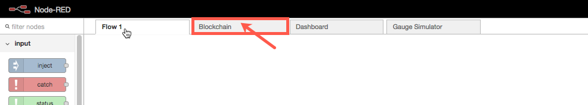

14. **Double click** on the *http request* node.

    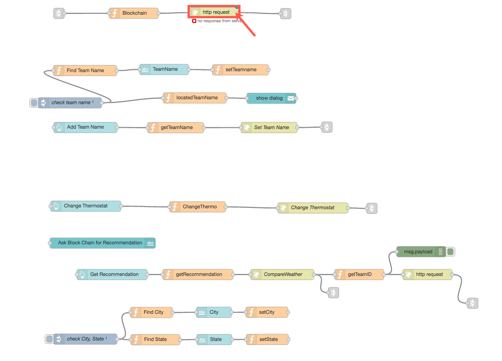

15. In the *Edit http request node* window, edit the *URL* field to **enter your Linux guest IP Address** where the x's are. This will allow NodeRED to talk with your blockchain through API. **Click** *Done*.

    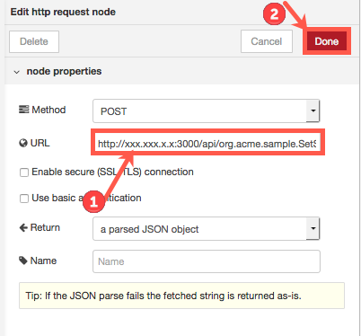

16. **Double click** on *Set Team Name* node.

    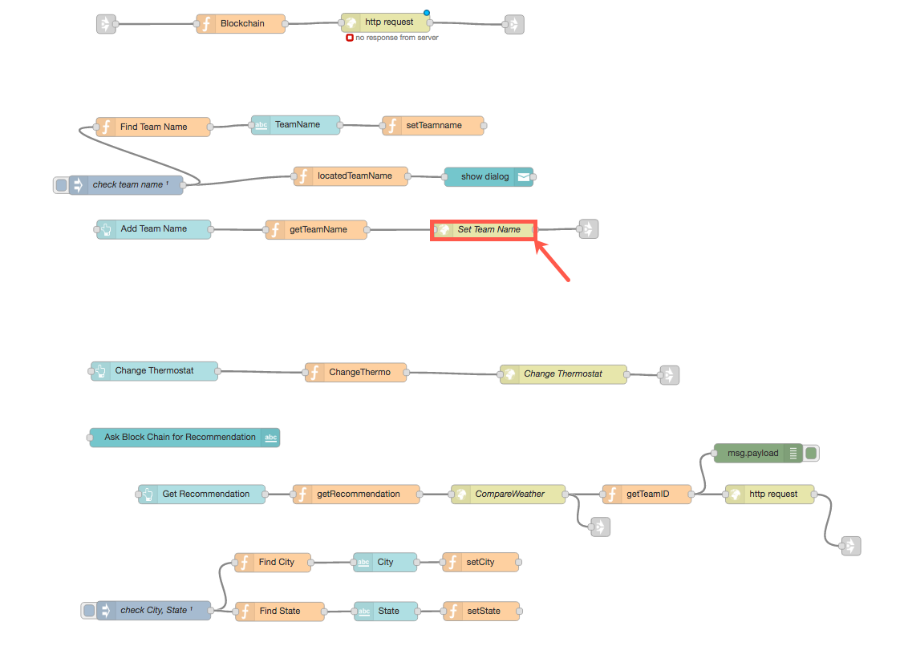

17. In the *Edit http request node* window, edit the *URL* field to **enter your Linux guest IP Address** where the x's are. This will allow NodeRED to talk with your blockchain through API. **Click** *Done*.

    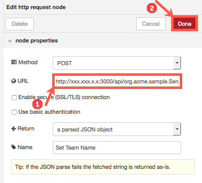

18. **Double click** *Change Thermostat*.

    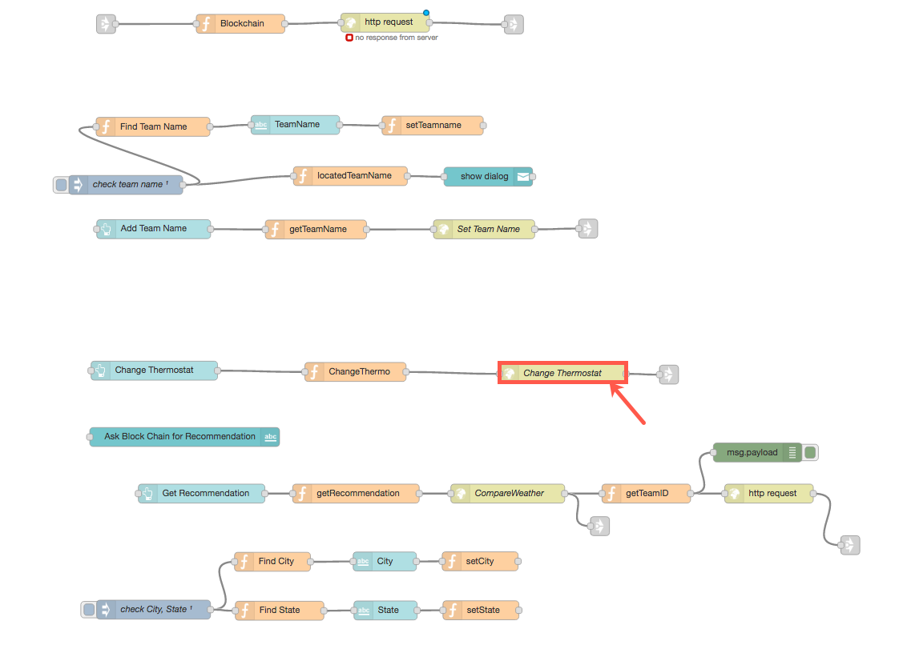

19. In the *Edit http request node* window, edit the *URL* field to **enter your Linux guest IP Address** where the x's are. This will allow NodeRED to talk with your blockchain through API. **Click** *Done*.

    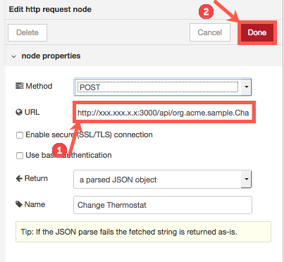

20. **Double click** on *Compare Weather*.

    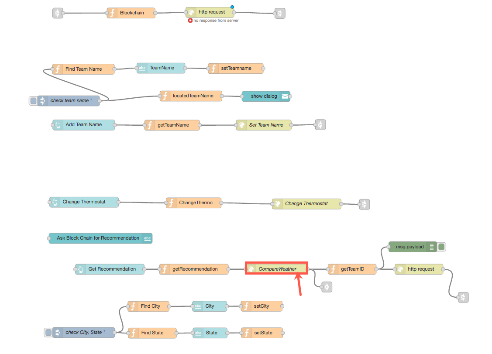

21. In the *Edit http request node* window, edit the *URL* field to **enter your Linux guest IP Address** where the x's are. This will allow NodeRED to talk with your blockchain through API. **Click** *Done*.

    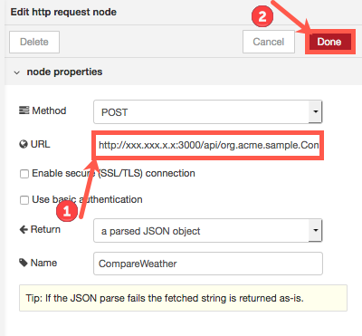

22. **Double click** on the *http request* node to the right of *Compare Weather*.

    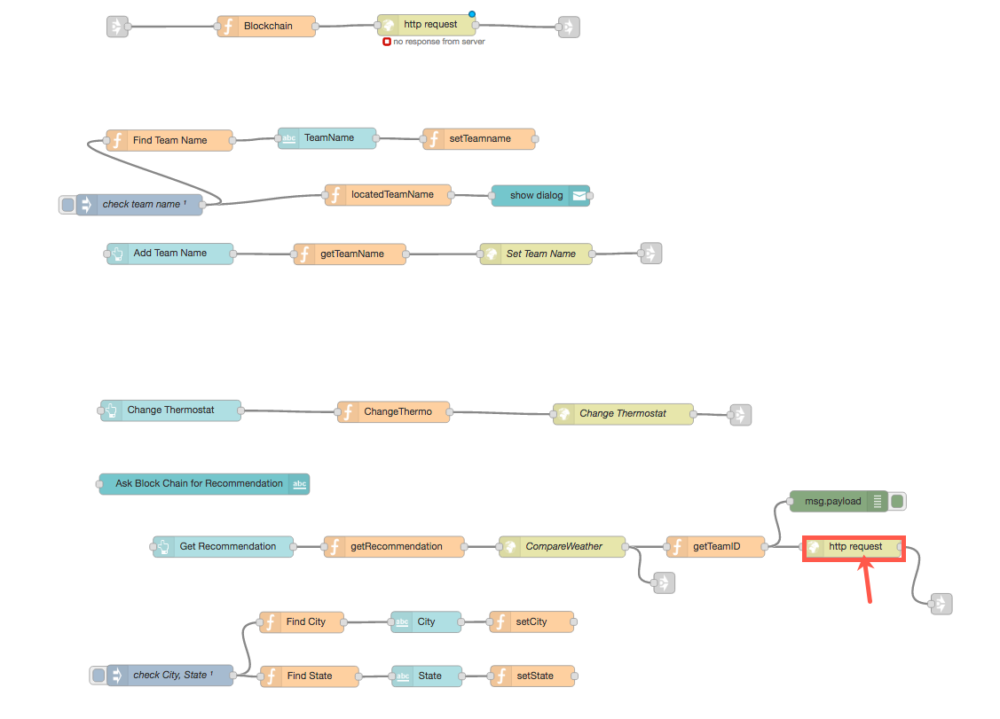

23. In the *Edit http request node* window, edit the *URL* field to **enter your Linux guest IP Address** where the x's are. This will allow NodeRED to talk with your blockchain through API. **Click** *Done*.

    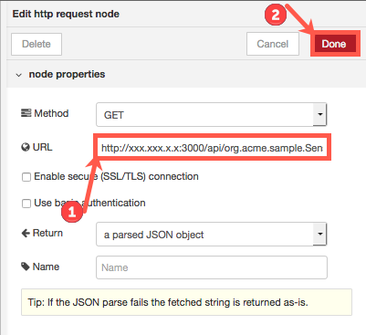

24. On the right side of the Node-RED browser, **click** *Deploy* to save the work you've imported.

    

    #### Interacting with blockchain through a dashboard

25. **Click** the *dashboard* tab in the upper right corner under *Deploy*.

    

26. **Click** the *pop out* button to open the dashboard in a browser.

    

27. A new tab should open. Your dashboard should look like the following image.

    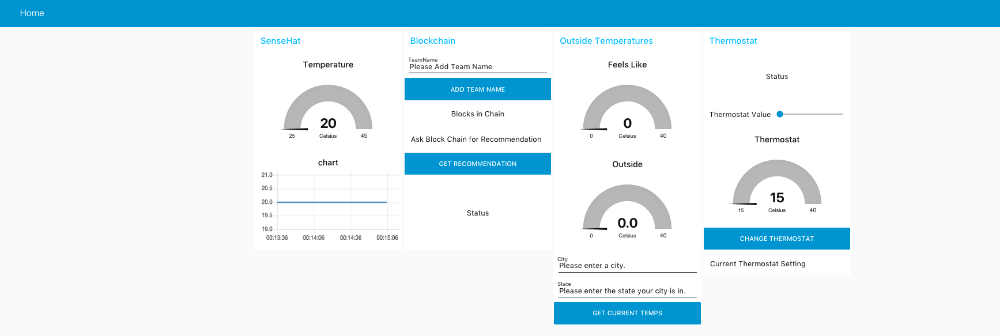

28. To interact with your simulated RaspberryPi, go back to your Node-RED tab and **select** the *Gauge Simulator* tab.

    

29. **Click** on the *Sensor Gauge Simulator* node.

    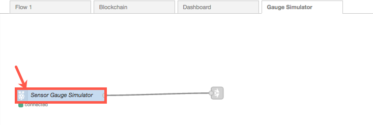

30. On the right side of the browser, **click** on the *Info* tab.

    

31. In the third paragraph under Information there is a hyperlink for the word *here*.  That hyperlink opens the simulator in a new tab. **Click** *here*.

    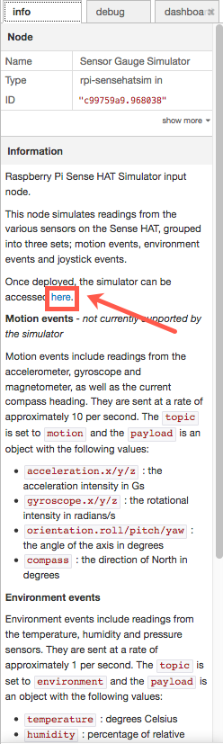

32. **Adjust** the temperature of the sensor in the simulator from 20 C.

    

33. Switch to the tab for your dashboard, notice the change to the sensor temperature and graph.

    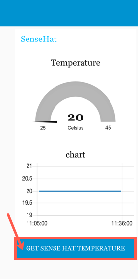

34. Continue to play with your dashboard to interact with blockchain via API. You can try the following:

    * Type in a team name & click *Add Team Name*. You should see a successful message afterward.

      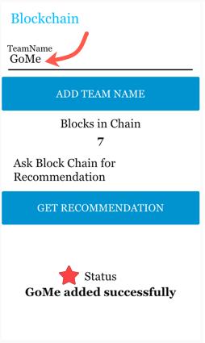

      

    * Change the thermostat by moving the slider next to *Thermostat Value*. Click *Change Thermostat*  to send the value to blockchain.'

      '

      

    * Type in a City and State to find outside temperatures. Click *Get Current Temps* to get the values.

      

    * After you have outside temperatures, you can click *Get Recommendation* to find the ideal temperatures for the thermostat. Notice that this will adjust your thermostat in the dashboard.

    * 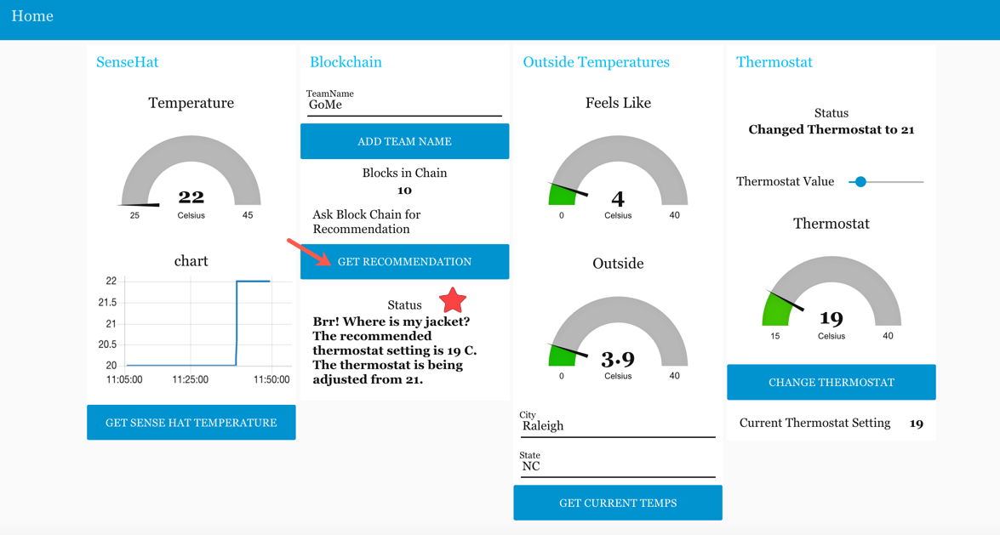

35. Congratulations! You've completed this journey!


