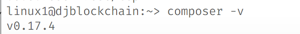
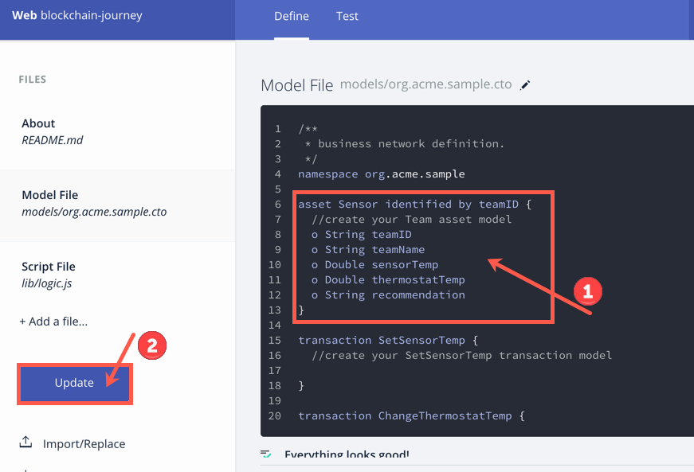
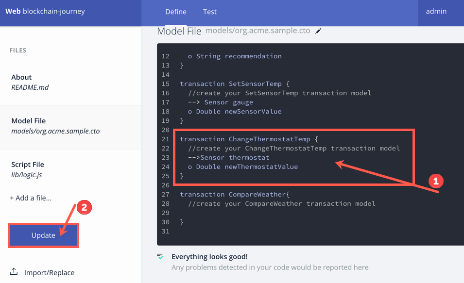
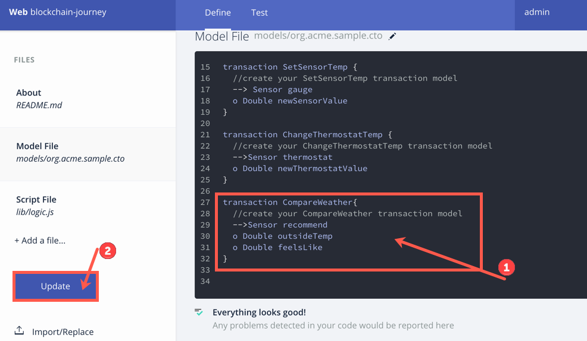
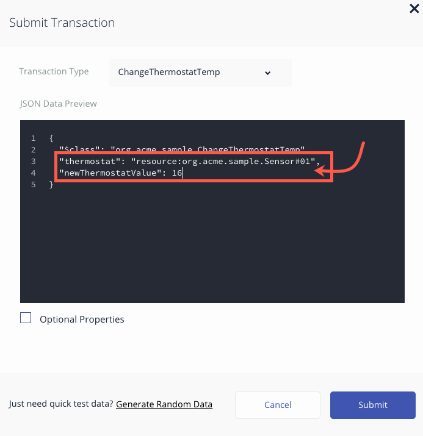
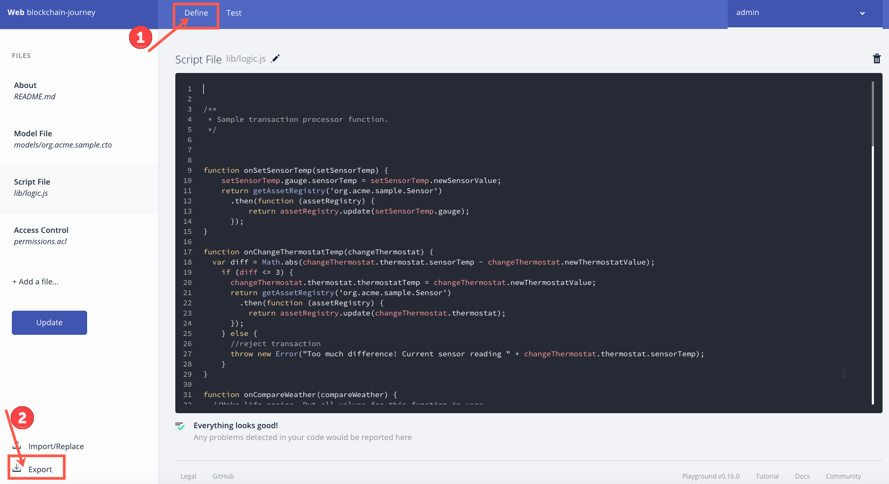
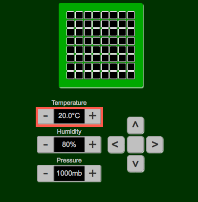

# LinuxONE 上的 Hyperledger Fabric 和 Hyperledger Composer

## 架构


本 Code Pattern 将指导您完成以下流程。

1.请求访问 LinuxONE Community Cloud。
2.在 LinuxONE Community Cloud 上创建您的 Linux 来宾系统。
3.设置和验证您的区块链环境。
4.在 Hyperledger Composer 中创建一个区块链项目。
5.通过 Composer Rest Server 和 NodeRed 与区块链和第三方 API 进行交互。


## 应用程序概述
这个 Code Pattern 的目标是，让您基本了解开发人员如何使用 Hyperledger Composer 与 Hyperledger Fabric 进行交互。在此次网络研讨会中，您将使用一个基于浏览器的 UI 来修改链代码，测试您的代码并部署更改。您还将了解如何使用工具获取代码并生成 API，以便通过 REST-ful 接口实现应用程序集成。 

本实验将分为 3 个部分： 

### 第 1 部分 \- 设置您的 LinuxONE Community Cloud 来宾系统

1.[请求访问 LinuxONE Community Cloud。](#request-access-to-linuxone-community-cloud)

2.[创建您的 LinuxONE 来宾系统](#create-your-linuxone-guest)

3.[针对 Hyperledger Fabric 和 Hyperledger Composer 设置您的 Linux 来宾系统](#setup-your-linux-guest-for-hyperledger-fabric-and-hyperledger-composer)

4.[验证 Hyperledger Fabric 和 Hyperledger Composer 的安装](#verify-the-installation-of-hyperledger-fabric-and-hyperledger-composer)

### 第 2 部分 - 创建一个区块链应用程序并生成 API

5.[导入您的区块链应用程序的组件](#importing-the-components-of-your-blockchain-application)

6.[创建您的区块链应用程序](#creating-your-blockchain-application)

7.[测试应用程序代码](#test-application-code)

8.[将应用程序部署到 Hyperledger Fabric](#deploy-application-to-hyperledger-fabric)

9.[利用您的区块链应用程序生成 API](#generating-api)

### 第 3 部分 - 通过 NodeRED 利用区块链 API

10.[将您的流导入 NodeRED 中](#importing-your-flow-into-nodered)

11.[通过仪表板与区块链进行交互](#interacting-with-blockchain-through-a-dashboard)


## 网络研讨会操作说明

### 场景概述
在这个 Code Pattern 中，我们将模拟一个恒温器和温度计来为我们提供温度数据。在真实场景中，这可能是家里或办公建筑中的温度传感器。该传感器可以通过 API 连接到 Nest 等真实恒温器或其他智能家庭设备。要避免家庭成员、室友、朋友或孩子们过度运行空调或取暖器，首先必须确定他们是否有权运行 Hyperledger Fabric 上的智能合约所定义的事务来调节恒温器。该合约会检查账本中记录的温度计的值，以确定他们的恒温器调节是否环保。其次，它会集成 Weather.com 来检查当前温度，并根据智能合约的条款将恒温器调节到理想设置。 

### 第 1 部分 - 设置您的 LinuxONE Community Cloud 来宾系统

在本 Code Pattern 这一部分，将请求访问 LinuxONE Community Cloud，建立一个 SLES 来宾系统，运行一个设置脚本并验证安装。

#### 请求访问 LinuxONE Community Cloud。

1.在浏览器中访问 https://developer.ibm.com/linuxone/。

   

2.**单击** *Start your trial now*。

   

3.**完成**页面上的必填字段并**选择** *Request your trial*。

   

4.您将转到以下页面。**单击** *Sign In*。

   

5.检查电子邮件，查找类似下图的注册确认邮件。在下一步中，需要使用这封电子邮件中的用户 ID 和密码。

   

   #### 创建您的 LinuxONE 来宾系统

6.返回浏览器中，**输入**来自该电子邮件中的*用户 ID* 和*密码*。**单击** *Sign in*。

   * 备注：现在是将该密码更改为您容易记住的密码的好时机。为此，可以在首次登录后，从网页的右上角选择您的用户名并选择帐户设置。

   

7.在 IBM LinuxONE Community Cloud 的主页中，在 Infrastructure 下的 Virtual Servers 上**选择** *Manage Instances*。

   

8.**单击** create。

   

9.完成以下信息：

   * 选择 *General purpose VM* 作为类型。

   * 输入实例名称 -  `DJBlockchain`。

   * 输入实例描述 -  `Blockchain guest for Developers Journey`。

   * 选择 *SLES12 SP2* 作为映像。

   * 选择 *LinuxONE-Medium* 作为风格。

     

10.**向下滚动**。在 *Select a SSH Key Pair* 下，**单击** *create*。

 

11.在弹出的对话框中，**输入**密钥名称 `DJBlockchain` 并**选择** *Create a new key pair*。

    

12.根据您的计算机，您可能会收到提示，询问您是否希望保存新的密钥对。如果希望保存，则选择 **Save File**。

    

13.在 *Select a SSH Key Pair* 框中，**选择**新创建的密钥对 *DJBlockchain*。

    

14.检查 Current Selection 信息的准确性，然后**单击**屏幕底部的 *create* 创建您的 SLES 12 LinuxONE 来宾系统。

    

15. 观看新创建的来宾系统的状态，完成以下启动阶段：networking :arrow_right: spawning :arrow_right: Active。当来宾系统显示 active 时，表明它已准备好使用。

    * *备注* - 记下您的来宾系统的 IP 地址。后续步骤需要使用它。

    

16.从您计算机上的终端，导航到保存 SSH 密钥对 *DJBlockchain* 的目录。下面给出了一个示例位置。

    


17.通过输入 `chmod 600 DJBlockchain.pem` 来修改您的私钥的权限。

    

18.从您的 *DJBlockchain.pem SSH* 密钥对所在的位置，输入命令 `ssh -i DJBlockchain.pem linux1@xxx.xxx.x.x`，其中 x 对应于您的 Linux 来宾系统 IP。

19.**键入** `yes` 来继续完成连接提示，然后**按下** *Enter* 键。

    

20.您现在已连接到您的 IBM LinuxONE Community Cloud 来宾系统！

    

    #### 针对 Hyperledger Fabric 和 Hyperledger Composer 设置您的 Linux 来宾系统

21.现在是时候来设置您的来宾系统了！运行以下命令，将设置脚本从 Github 存储库移动到您的 Linux 来宾系统中。

    `wget https://raw.githubusercontent.com/IBM/HyperledgerFabric-on-LinuxOne/master/Linux1BlockchainScript.sh`

    

22.输入 `ls` 来确认该文件位于您的目录中。 

    

23.要让该文件可执行，请运行 `chmod u+x Linux1BlockchainScript.sh`，然后运行 `ls` 确保它显示为可执行文件。

    

24.您已准备好运行设置脚本！使用以下命令运行该脚本：`./Linux1BlockchainScript.sh`。请耐心等待。这会花点时间！


25.首次运行该脚本时，会设置一些权限和环境变量，您需要退出并再次登录会话。 

    * **键入** `exit` 来退出会话。 

    * 再次**登录** -  `ssh -i DJBlockchain.pem linux1@xxx.xxx.x.x`，其中 x 对应于您的 Linux 来宾系统 IP。

    * 再次**运行**该脚本 -  `./Linux1BlockchainScript.sh`

```
      linux1@djblockchain:~> ./Linux1BlockchainScript.sh 
      ID linux1 was not a member of the docker group.This has been corrected.
      PATH was missing '/data/npm/bin'.This has been corrected.
      Some changes have been made that require you to log out and log back in.
      Please do this now and then re-run this script.
```
26.命令行返回结果时，表明运行已完成。它看起来类似于下图。


27.要让该脚本执行的一些更改生效，可键入 `exit` 退出 ssh 会话。


28.登录回您的来宾系统。`ssh -i DJBlockchain.pem linux1@xxx.xxx.x.x`，其中 x 是您的来宾系统的 IP 地址值。（如果需要帮助查找该值，请参阅第 15 步。）


#### 验证 Hyperledger Fabric 和 Hyperledger Composer 的安装

29.要查看您的区块链网络是否正常运行，可使用命令 `docker ps -a`。您会看到 4 个容器，它们包含的映像名称类似于下图。


30.输入 `composer -v` 验证 Composer 命令行接口和其他工具已安装。



31.使用 `ps -ef|grep playground` 命令查找 Composer Playground 的进程，以验证它正在运行。 


32.打开浏览器并将 `xxx.xxx.x.x:8080` 输入到地址栏中，其中 x 对应于您的 Linux 来宾系统的 IP 地址。 

    * **备注：**推荐使用 Chrome 作为 Hyperledger Composer Playground 的浏览器。另外推荐在匿名窗口中打开 Playground。这样，如果开始注意到怪异的行为，就可以快速清除缓存和历史记录。
    * **备注：**如果使用 Firefox，无法在 Private 模式下使用它。 
    * 您应该会看到以下信息：


33.恭喜您！第 1 部分现在已完成！现在进入有趣的部分。:smiley:


### 第 2 部分 - 创建一个区块链应用程序并生成 API

#### 导入您的区块链应用程序的组件

1.在计算机上的终端中，转到主目录。`cd $HOME`

2.如果尚未安装 Git，请为您的计算机[安装 Git](https://git-scm.com/book/en/v2/Getting-Started-Installing-Git_)。 

3.安装 Git 后，运行以下命令来克隆本练习需要的材料。`git clone https://github.com/IBM/HyperledgerFabric-on-LinuxOne.git`


4.要找到本练习需要的文件，可运行 `cd HyperledgerFabric-on-LinuxOne/code/`，然后运行 `ls` 来查看该目录中有哪些内容。

   

5.输入 `pwd` 来查看您在系统上的位置。保存此信息。一些步骤中需要此信息。

   

6.转到打开了 Composer Playground 的浏览器。如果已关闭它，可以将 `xxx.xxx.x.x:8080` 输入到地址栏中，在浏览器中打开它，其中 x 对应于您的 Linux 来宾系统的 IP 地址。

   * **备注：**您需要在全屏（完全展开）模式下查看浏览器，以便能够访问所有信息，防止某些屏幕上的无法滚动问题。

   

7.选择 **Deploy a new business network**。
  

8.完成 *BASIC INFORMATION*。

   * 为您的新业务网络提供一个名称：**blockchain-journery**

   * 描述您的业务网络的用途：**Creating my first blockchain network.**

     

9.向下滚动，直到看到 *Choose a Business Network Definition to start with:*，然后选择 **empty-business-network** 和 **Deploy**。
   

10.* 从 *My Wallet* 中选择 **Connect now**，以进入您的业务网络。


11.选择 **Add a File**。

    


12.从弹出的 *Add a file* 对话框中选择 **browse**。

    

13.在文件资源管理器窗口中，导航到保存下载的这些文件的位置。如果需要帮助查找此位置，请参阅第 5 步。**选择** *README.md* 并**单击** *Open*。
   

14.**选择** *Add*。
   

15.在 *Current file will be replaced* 对话框中，**选择** *Replace*。


16.让我们继续向 Composer Playground 添加文件。**重复第 11-15 步来添加以下文件**：

* *org.acme.sample.cto* - 此文件位于 models 文件夹中。在本练习中，将使用此文件为您的资产和事务创建一个模型。还可以在此文件中创建参与者。这类似于创建一个 Java 类并定义该类中需要的内容。
* *logic.js* - 该文件位于 lib 文件夹中。这个 JavaScript 文件将成为您的应用程序的中枢。此文件中的代码是您的智能合约，它定义了事务如何执行。这类似于 Java 方法。
* **最后添加：***permissions.acl* - 您将在这个文件中限制区块链网络中的参与者的权限。

17.您的文件现在都已加载到 Composer Playground 中。**单击**浏览器左侧的 *Update*。 

   

   #### 创建您的区块链应用程序

18.单击 **Model File**。

    

19.在右侧的 **editor** 中单击，以便开始编写您的模型。 

    * 备注：在实验期间**不要**修改名称空间。

      

20.在一个新行上，为您的资产 `Sensor` 设置以下属性。

    * 备注：模型中使用一个小写的 "o" 作为项目符号。

    * `o String teamID` - 这将是分配给您的团队的值。（已经分配！）

    * `o String teamName` - 这可以是任何值！构想一个合适的名称！

    * `o Double sensorTemp` - 来自 Raspberry Pi 的温度将存储在这里。

    * `o Double thermostatTemp` - 您将为恒温器创建一个温度。

    * `o String recommendation` - 将基于 `CompareWeather` 事务来填充此属性。

    * **单击** *Update* 保存更改。

      

21.现在为 `SetSensorTemp` 创建您的第一个事务模型。输入以下属性：

    * `--> Sensor gauge` - 事务需要将数据放在 `Sensor` 资产中。这会传递该资产的引用，以便我们在事务的逻辑中处理该资产。

    * `o Double newSensorValue` - 将根据从（用于获取温度的） NodeRed 传感器传入事务中的温度来设置该变量。

    * **单击** *Deploy* 保存更改。

      

22.构建您的 `ChangeThermostatTemp` 事务模型。添加以下属性：

    * `--> Sensor thermostat` - 事务需要将数据放入恒温器的 `Sensor` 资产中。这会传递该资产的引用，以便我们在事务的逻辑中处理该资产。

    * `o Double newThermostatValue` - 可通过它将一个新的建议值发送到事务中。在 logic 选项卡中，我们将使用此值与温度计显示的值进行比较，确定是否应调节恒温器的值。

    * **单击** *Update* 保存更改。

      

23.输入以下值来构建您的 `CompareWeather` 事务模型：

    * `--> Sensor recommend` - 事务需要将数据放入 `Sensor` 资产中。这会传递该资产的引用，以便我们在事务的逻辑中处理该资产。
    * `o Double outsideTemp` - 查看 [WeatherUnderground.com API](https://www.wunderground.com/weather/api/d/docs?d=data/conditions) 中的条件，可以看到该调用可能返回的所有可能数据。基于该数据，决定根据室外实际温度和体感温度来推荐恒温器设置。此变量存储通过 NodeRed 从 Weather.com 传给它的室外温度值。API 页面上的模型显示了返回的数据是摄氏度还是华氏度，以及它的变量类型。在本练习中，我们将使用摄氏度。

    * `o Double feelsLike` - 此变量存储来自 Weather.com 的 feels_like 值。

    * **单击** *Update* 保存更改。

      

24.单击 **Script File** 选项卡。


26.**在编辑器中检查代码。**验证您的变量名与此处的变量名相匹配。大小写很重要！如果名称不匹配，则会发生错误。 

    * 是否在猜测该代码对每个事务执行何种操作？

      

    #### 测试应用程序代码

27.单击顶部的 **Test** 选项卡来测试您的代码。


28.请注意，在这个特定案例中，因为没有参与者，所以 **Test** 选项卡打开了左侧的 **Asset** 菜单。必须拥有资产才能执行任何事务。

    * 单击 **Create New Asset**。

      

29.填写以下信息，创建一个示例资产来测试您的代码：

   * `"teamID": "teamID:**xxx**"`，其中** **xxx** **是您喜欢的任何团队编号。

   * `"teamName":""` - 该名称可以是您喜欢的任何名称。请提供合适的名称！:bowtie:

   * `"sensorTemp": **0**` - 将** **0** **更改为任何值。使用 NodeRed 时，温度将为摄氏度。

   * `"thermostatTemp": **0**` - 将** **0** **更改为任何值。这会初始化您的恒温器，以便挑选您想使用的值。

   * `"recommendation": ""` - 将此值保留原样。

   * *将您用于 `sensorTemp` 和 `thermostatTemp` 的值记录在某处**。

     

30.单击 **Create New**。

   

31.创建您的 **Team** 资产后，它应该显示在注册表中，如下图所示。

    

32.您已准备好执行您的第一个事务。**单击** *Submit Transaction*。

    

33.**Submit Transaction** 对话框将打开一个新窗口。 

    * 确保将 **Transaction Type** 设置为 `SetSensorTemp`。

    * 修改 JSON 数据 `"gauge": "resource:org.acme.sample.Sensor#teamID:xxx"` - 输入您的团队的标识符代替样本 JSON 数据中的 **xxx**。

    * 修改 JSON 数据 `"newSensorValue": 0` - 输入您的传感器可能产生的值。

    * 单击 **Submit**。

      

34.如果提交了该事务和正确的团队 ID，您的注册表中会显示一个事务和您在上一步中输入的数据。恭喜您！您现在已完成一个事务。:thumbsup:

    

35.验证 `SetSensorTemp` 更新了您的资产中的 `sensorTemp` 值。单击 **Sensor**。

    

36.检查 `sensorTemp` 值。它是否拥有来自 `SetSensorTemp` 事务的新值？

    

37.让我们执行另一次事务。选择 **Submit Transaction**。

    

38.这一次让我们运行 `ChangeThermostatTemp`。 

   * 在 **Transaction Type** 下拉列表中，选择 `ChangeThermostatTemp`。
     

   * 编辑事务 `"thermostat": "resource:org.acme.sample.Sensor#teamID:xxx"` 的样本 JSON 数据 - 将 **xxx** 更改为您的团队 ID 值。

   * 编辑事务 `"newThermostatValue": 0` 的样本 JSON 数据 - 将 **0** 替换为您能调节恒温器时希望看到的值。

   * 单击 **Submit**。

     

   * 如果您为恒温器选择了一个不在 `sensorTemp` 值的上下 3 度范围内的值，您将获得一条类似下图的错误消息。如果获得此消息，可输入另一个值并单击 Submit。

     

   * 如果您有调节恒温器的权限，您将返回到事务注册表，可以在这里看到您刚提交的数据。

     

   * 如果出于某种原因，您忘记修改 teamID 值或将它更新成了错误的值，就会看到类似下图的错误。检查 teamID 值并再试一次。

     

39.验证上一次事务更新了您的资产。单击 **Sensor**。

    

40.验证您的团队的 `thermostatTemp` 属性已更新为您在 `ChangeThermostatTemp` 事务中成功提供的值。

    * **备注：**在第 40 步，可以验证恒温器最初设置为 20，现在设置为 16。

      

41.是处理 `CompareWeather` 事务的时候了。单击 **Submit Transaction**。

    

42.从 *Transaction Type* 下拉列表中选择 **CompareWeather**。

    

43.完成 **CompareWeather** 事务。

    * 修改 JSON 数据 `"recommend": "resource:org.acme.sample.Sensor#teamID:xxx"` - 将 **xxx** 替换为您的团队 ID。

    * 修改 JSON 数据 `"outsideTemp": 0` - 输入一个值作为室外温度。

    * 编辑 JSON 数据 `"feelsLike": 0` - 输入一个值作为可以在室外感受到的温度。

    * 单击 **Submit**。

      

44.验证您的事务已显示在事务注册表中。

    

45.单击 **Sensor**。 

    

46.验证您的团队资产中的 `recommendation` 变量中现在有一条消息，而且 `thermostatValue` 已更新为推荐的值。

    

47.继续针对所有场景测试您的代码，了解您的合约能做什么。下面给出了针对剩余场景的提示：（您需要查看 Define 选项卡下的 Script File 来确定条件。）

    * ChangeThemostatTemp：
      - [ ] 一次成功事务，在该事务中，已在 Sensor 资产中更新了 `thermostatValue`。
      - [ ] *Submit Transaction* 窗口中的一条错误消息表明，您没有调节恒温器的权限。
    * CompareWeather：
      - [ ] 一个基于 `outsideTemp` 值的事务，其中的温度很高。
      - [ ] 一个基于 `outsideTemp` 值的事务，其中的温度适中。
      - [ ] 一个基于 `outsideTemp` 值的事务，其中的温度很低。
      - [ ] 一个基于 `feelsLike` 值的事务，其中的温度很高。
      - [ ] 一个基于 `feelsLike` 值的事务，其中的温度适中。
      - [ ] 一个基于 `feelsLike` 值的事务，其中的温度很低。

    * **备注：**像之前的步骤中所做的一样，您应该验证您的资产值在每次事务后已适当更新。


#### 将应用程序部署到 Hyperledger Fabric

48.在连接到您的 Linux 来宾系统的终端中，输入命令 `cd ~/.composer-connection-profiles/`。输入 `ls` 来查看该目录中的配置文件。该配置文件是在设置脚本期间创建的。您需要使用其中的信息来将 Hyperledger Composer 连接到 Hyperledger Fabric。

    

49.转到配置文件目录，键入 `cd hlfv1` 中，运行 `cat connection.json` 来查看该文件。让终端保持运行，稍后您需要查看此信息。

    

50.返回到运行 Hyperledger Composer Playground 的浏览器中，**单击** *Define* 选项卡，然后**单击** *Export* 将代码保存到桌面。这是一种安全措施。导出我们在第 2 部分开头部分导入的所有文件，将它们保存到一个称为业务网络归档文件 (.bna) 的压缩文件中。

    

51.在弹出的对话框中，**单击** *Save File*。

    

52.在浏览器的右上角，**选择** *admin* 并**单击** *logout*。

    

53.在右下角，**选择** *Create ID card*。

    

54.在 *Create ID Card* 对话框中，**选择** *Hyperledger Fabric v1.0* 并**单击** *Next*。

    

55.根据 Linux 来宾系统上的 connection.json 中的信息，完成以下字段。这是在第 49 步中找到的终端中的信息。**Orderer、Channel、MSP ID、CA、Peers 和 Key Value Store 的信息必须准确。**

    * Connection Profile - LinuxONECC

    * Orderer(s) - `grpc://localhost:7050`

    * Channel - `composerchannel`

    * MSP ID - `Org1MSP`

    * CA - `http://localhost:7054`

    * Peer(s) - `grpc://localhost:7051`、`grpc://localhost:7053`

    * Key Value Store - `/home/linux1/.composer-credentials`

    * **单击** *Next*。

      

56.在 *Create ID Card* 对话框中，完成以下步骤： 

    * **选择** *ID and Secret*。
    * **创建** *Enrollment ID* `PeerAdmin`。
    * **创建** *Enrollment Secret* `linux`。
    * **选择** *Admin Card* 作为卡类型。
    * **选择** *Peer Admin* 和 *Channel Admin* 作为角色。
    * **单击** *Create*。

    

57.在 *Identity cards for LinuxONECC* 下，**单击** *Deploy a new business network*。

    

58.在 *Basic Information* 下，**输入**业务网络名称 `journey-deploy`。

    

59.导航到第 51 步中保存 `blockchain-journey.bna` 的位置，**选择** `blockchain-journey.bna` 并**单击** *Open*。

    

60.检查您的选择的摘要并**单击** *Deploy*。

    

61.在您的钱包中，您现在应在 *Identity cards for LinuxONECC* 下看到 `journey-deploy` 的新身份卡。

    

62.返回到终端，输入 `docker ps -a`。可以看到现在有一个新容器正在运行，其中 Composer Playground 已将代码部署到 Hyperledger Fabric.

    

63.切换回您的 Hyperledger Composer Playground 浏览器，**单击** *Connect now*。

    

64.成功部署后，您会在 Hyperledger Composer Playground 中看到您的 journey-deploy。恭喜您！您已将第一个区块链应用程序部署到 Hyperledger Fabric。

    * **备注：**作为一种安全措施，请检查 Model File 和 Script File 来确保您的代码已存在。在 test 选项卡中运行一些事务也是一种不错的做法。

    

    #### 生成 API

65.在终端中，发出以下命令来启动 API Rest 服务器：

    * `mkdir /data/linux1/playground`

    * `nohup composer-rest-server -p hlfv1 -n journey-deploy -i PeerAdmin -s linux -N always >/data/linux1/playground/rest.stdout 2>/data/linux1/playground/rest.stderr & disown`

      

66.验证 Rest 服务器进程正在运行。`ps -ef|grep rest`

    

67.要查看您的 API，请返回到浏览器，打开一个新的选项卡或窗口。在地址栏，输入 `http://xxx.xxx.x.x:3000/explorer`，其中 x 是您的 Linux 来宾系统的 IP 地址。您会看到一个类似下图的页面。

    

68.展开不同的方法，以查看可通过 REST API 执行的各种调用和参数。也可以在此浏览器中测试该 API，了解如何生成该 API 并查看响应。

    

69.恭喜您！您现在已有一个工作正常的区块链应用程序，并且创建了 API 来调用您的区块链应用程序。


### 第 3 部分 - 通过 NodeRED 利用区块链 API 


#### 将您的流导入 NodeRED 中
1.在浏览器的一个新选项卡或窗口中打开 NodeRED。在地址栏中输入 `http://xxx.xxx.x.x:1880`，其中 x 对应于您的 Linux 来宾系统 IP 地址。

   

2.您需要向 NodeRED 面板添加更多节点，才能拥有完整的工作流。为此，**选择**右上角的 *menu* 按钮。

   

3.从下拉菜单中**选择** *Manage Palette*。

   

4.在 *User Settings* 窗口中，**单击** *Install*，在搜索栏中**键入** `dashboard`，然后选择 *node-red-dashboard* 旁边的 **Install**。

   

5.在 *Install nodes* 弹出窗口中，**单击** *Install*。

   

6.现在是安装 RaspberryPi Sense Hat 模拟器的时候了。在 *User Settings* 窗口中的 *Install* 下，在搜索栏中**键入** `sense`，然后选择 *node-red-pi-sense-hat-simulator* 旁边的 **Install**。

   

7.在 *Install nodes* 弹出窗口中，**单击** *Install*。

   

8.**单击** *Close* 退出 User Settings 对话框。

 

9.从 [GitHub 存储库](https://raw.githubusercontent.com/IBM/HyperledgerFabric-on-LinuxOne/master/code/node-red.json) **复制**所有 JSON 文件以导入该流中。 

    - **备注：**实现此目的的最简单方法是单击上面的超链接。也可以在 GitHub 存储库中的 code 文件夹中找到它，名为 `node-red.json`。要在 GitHub 中查看它，请**单击** *node-red.json*，**选择** *raw*，然后复制它。 


10.**单击**右上角的 *menu 图标*，将它粘贴到 NodeRed 中。


11.**选择** *Import -> Clipboard*。


12.将该代码**粘贴**到编辑器中。确保**选择**了“current flow”按钮。**选择** *Import*。


13.现在，NodeRED 中应该有 3 个流 - Blockchain、Dashboard 和 Gauge。


14.在 Node-RED 浏览器的右侧，**单击** *Deploy* 保存您导入的工作。


#### 通过仪表板与区块链进行交互

15.**单击**右上角的 *Deploy* 下的 *dashboard* 选项卡。

    

16.**单击** *pop out* 按钮在浏览器中打开仪表板。

    

17.这会打开一个新的选项卡。您的仪表板应该类似于下图。

    

18.要与模拟的 RaspberryPi 进行交互，返回到您的 Node-RED 选项卡并**选择** *Gauge Simulator* 选项卡。

    

19.**单击** *Sensor Gauge Simulator* 节点。

    

20.在浏览器的右侧，**单击** *Info* 选项卡。

    

21.在 Information 下的第 3 段中，单词 *here* 包含一个超链接。该超链接会在一个新的选项卡中打开模拟器。**单击** *here*。

    

22.在模拟器中将传感器的温度从 20 C **调节**为其他值。

    

23.切换回您的仪表板的选项卡，注意传感器温度和图表的变化。

    

24.继续使用仪表板通过 API 与区块链进行交互。可以尝试以下操作：

    * 键入一个团队名称并单击 *Add Team Name*。您随后会看到一条成功消息。

      

      

    * 通过滑动 *Thermostat Value* 旁边的滑块来更改恒温器温度。单击 *Change Thermostat* 将该值发送到区块链。’

      ’

      

    * 键入一个州和城市，以查找室外温度。单击 *Get Current Temps* 获取温度值。

      

    * 拥有室外温度后，可以单击 *Get Recommendation* 来查找恒温器的理想温度。请注意，这会在仪表板中调节恒温器。

    * 

25.恭喜您！您已完成这个 Code Pattern！


